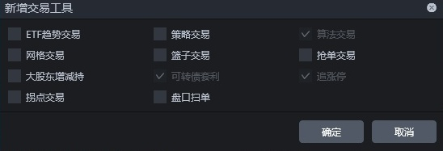

<!-- Source: https://ptradeapi.com/index.html -->

<!-- Page: Ptrade 量化交易 API接口文档 -->

# 必看-快速了解Ptrade

本文在原API文档的基础上加入个人的理解，和容易被忽略的地方，对原文档不够详尽的地方，稍加提示,并加入 可转债实盘 的示例代码

#### 下面针对平时咨询最多的问题，简要的 Q & A :

Ptrade运行在券商机房，属于托管模式，所以稳定性和速度要高于QMT, 不会因为网络不稳定，电脑死机等外部因素导致行情丢失

Ptrade由恒生电子开发，券商采购后提供给用户使用，会有一定的资金要求门槛，不同营业部不同券商会有区别，可扫码公众号二维码咨询

Ptrade支持的交易品种：股票，基金ETF，可转债（T+0），债券，级别为tick，最小时间粒度是3s。委托档位默认可以获取到十档

Ptrade内置运行python版本：部分券商（国金）Ptrade内置python版本更新到3.11，而大部分券商停留在3.5。 Python版本不同，Ptrade部分函数也会有不同，数据返回的格式也有区别，具体数据以你券商Ptrade为准

运行模式：
在Ptrade里面写好的策略代码，保存，在交易面板里点击运行，程序每天运行,真正做到无人值守,不需要额外购买云服务器或者本地电脑。如果需要停止，在Ptrade里面点击停止按钮即可终止策略

Ptrade编辑策略环境：windows系统。支持虚拟机上安装运行；如果是macbook OSX / Linux系统，
可以先安装一个虚拟机，然后将Ptrade安装在虚拟机上，在上面编写你的策略代码并运行，后面就可以退出你的虚拟机，而策略会在券商机房里面一直运行。

除了使用python编程编写策略以外，Ptrade也自带了量化工具，你只需要点点鼠标，设置几个参数就可以运行一些基本的大众化量化策略，比如有：ETF趋势交易，网格交易，大股东增持策略，拐点交易，盘口扫单，篮子交易，追涨停，可转债套利等

由于托管在券商机房，Ptrade处于内网环境，无法连接到互联网。并且Ptrade内部无法通过python的pip安装第三方的库，只允许使用内置的第三方库，具体支持的第三方库可以参考这里
[内置第三方库](https://ptradeapi.com/index.html#支持的三方库)

但也有极少数的券商的Ptrade支持链接外网功能，因为可以通过http接口的方式与Ptrade进行数据传输，甚至可以通过http触发下单信号，Ptrade只执行下单操作，笔者编写了大量的可转债接口数据，可以实时传输给Ptrade，从而解决Ptrade缺乏可转债溢价率，规模，评级，强赎，YTM等因子的数据源问题，因子笔者推荐大家开通此类券商的ptrade，可以很有效地解决数据缺失的问题

##### Ptrade支持：沪深A股，主板，中小板，创业板，科创板

##### Ptrade默认可获取委托十档数据， 部分券商内置了L2逐笔数据，重点是免费的

## 常见问题解答（个人整理）

Ptrade常见问题(不定期收集群友反馈的问题) [点击进入](https://ptradeapi.com/hub/data/qa_data.html)
