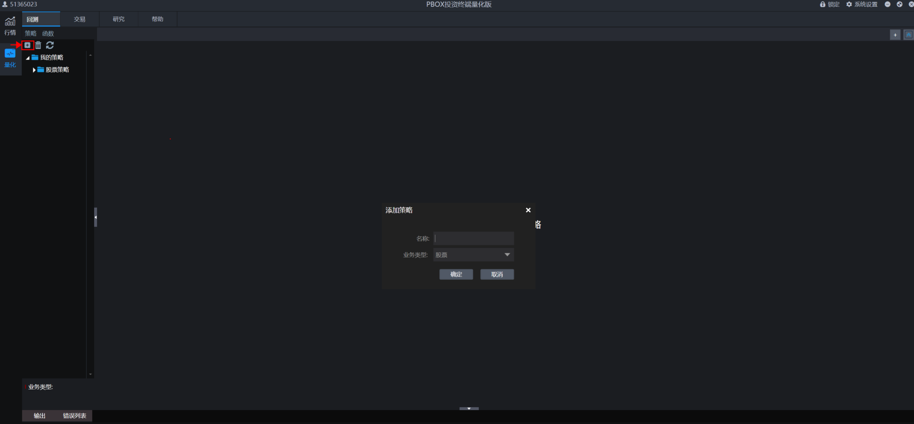

<!-- Source: https://ptradeapi.com/index.html -->

<!-- Page: Ptrade 量化交易 API接口文档 -->

# 快速入门

## 新建策略

开始回测和交易前需要先新建策略，点击下图中左上角标识进行策略添加。可以选择不同的业务类型（比如股票），然后给策略设定一个名称，添加成功后可以在默认策略模板基础上进行策略编写。

## 新建回测

策略添加完成后就可以开始进行回测操作了。回测之前需要对开始时间、结束时间、回测资金、回测基准、回测频率几个要素进行设定，设定完毕后点击保存。然后再点击回测按键，系统就会开始运行回测，回测的评价指标、收益曲线、日志都会在界面中展现。

## 新建交易

交易界面点击新增按键进行新增交易操作，策略方案中的对象为所有策略列表中的策略，给本次交易设定名称并点击确定后系统就开始运行交易了。

交易开始运行后，可以实时看到总资产和可用资金情况，同时可以在交易列表查询交易状态。

交易开始运行后，可以点击交易详情，查看策略评价指标、交易明细、持仓明细、交易日志。

## 策略运行周期

回测支持日线级别、分钟级别运行，详见 [handle_data](https://ptradeapi.com/index.html#handle_data) 方法。

交易支持日线级别、分钟级别、tick级别运行，日线级别和分钟级别详见 [handle_data](https://ptradeapi.com/index.html#handle_data) 方法，tick级别运行详见 [run_interval](https://ptradeapi.com/index.html#run_interval) 和 [tick_data](https://ptradeapi.com/index.html#tick_data) 方法。

频率：日线级别

当选择日线频率时，回测和交易都是每天运行一次，回测运行时间为每个交易日的15:00，交易运行时间为尾盘固定时间(允许券商可配)，默认为14:50分。

频率：分钟级别

当选择分钟频率时，回测和交易都是每分钟运行一次，运行时间为每根分钟K线结束。

频率：tick级别

当选择tick频率时，交易最小频率可以达到3秒运行一次。

## 策略运行时间

盘前运行:

9:30分钟之前为盘前运行时间，交易环境支持运行在 [run_daily](https://ptradeapi.com/index.html#run_daily) 中指定交易时间(如time='09:15')运行的函数；回测环境和交易环境支持运行 [before_trading_start](https://ptradeapi.com/index.html#before_trading_start) 函数

盘中运行:

9:31(回测)/9:30(交易)~15:00分钟为盘中运行时间，分钟级别回测环境和交易环境支持运行在 [run_daily](https://ptradeapi.com/index.html#run_daily) 中指定交易时间(如time='14:30')运行的函数；回测环境和交易环境支持运行 [handle_data](https://ptradeapi.com/index.html#handle_data) 函数；交易环境支持运行 [run_interval](https://ptradeapi.com/index.html#run_interval) 函数和  tick_data函数

盘后运行:

15:30分钟为盘后运行时间，回测环境和交易环境支持运行 [after_trading_end](https://ptradeapi.com/index.html#after_trading_end) 函数(该函数为定时运行)；15:00之后交易环境支持运行在 [run_daily](https://ptradeapi.com/index.html#run_daily) 中指定交易时间(如time='15:10')运行的函数，

## 交易策略委托下单时间

使用order系列接口进行股票委托下单，将直接报单到柜台。

## 回测支持业务类型

目前所支持的业务类型:

1、普通股票买卖(单位：股)。

2、可转债买卖(单位：张，T+0)。

3、融资融券担保品买卖(单位：股)。

4、期货投机类型交易(单位：手，T+0)。

5、LOF基金买卖(单位：股)。

6、ETF基金买卖(单位：股)。

## 交易支持业务类型

目前所支持的业务类型:

1、普通股票买卖(单位：股)。

2、可转债买卖(具体单位请咨询券商，T+0)。

3、融资融券交易(单位：股)。

4、ETF申赎、套利(单位：份)。

5、国债逆回购(单位：份)。

6、期货投机类型交易(单位：手，T+0)。

7、LOF基金买卖(单位：股)。

8、ETF基金买卖(单位：股)。

### 交易标的对应最小价差

1.股票买卖(最小价差：0.01)。

2.可转债买卖(最小价差：0.001)。

3.LOF买卖(最小价差：0.001)。

4.ETF买卖(最小价差：0.001)。

5.国债逆回购(最小价差：0.005)。

6.股指期货投机类型交易(最小价差：0.2)。

7.国债期货投机类型交易(最小价差：0.005)。
