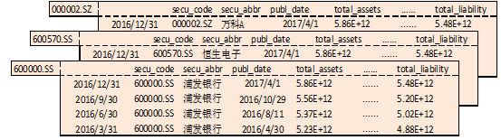

<!-- Source: https://ptradeapi.com/index.html -->

<!-- Page: Ptrade 量化交易 API接口文档 -->


# 策略API介绍

## 设置函数

### set_universe-设置股票池

```
set_universe(security_list)
```

#### 使用场景

该函数仅在回测、交易模块可用

#### 接口说明

该函数用于设置或者更新此策略要操作的股票池。

注意事项：

股票策略中，该函数只用于设定get_history函数的默认security_list入参, 除此之外并无其他用处，因此为非必须设定的函数。

#### 参数

security_list: 股票列表，支持单支或者多支股票(list[str]/str)

#### 返回

None

#### 示例

```
def initialize(context):
    g.security = ['600570.SS','600571.SS']
    # 将g.security中的股票设置为股票池
    set_universe(g.security)

def handle_data(context, data):
    # 获取初始化设定的股票池行情数据
    his = get_history(5, '1d', 'close', security_list=None)
```

### set_benchmark-设置基准

```
set_benchmark(sids)
```

#### 使用场景

该函数仅在回测、交易模块可用

#### 接口说明

该函数用于设置策略的比较基准，前端展现的策略评价指标都基于此处设置的基准标的。

注意事项：

此函数只能在initialize使用。

#### 参数

security：股票/指数/ETF代码(str)

#### 默认设置

如果不做基准设置，默认选定沪深300指数(000300.SS)的每日价格作为判断策略好坏和一系列风险值计算的基准。如果要指定其他股票/指数/ETF的价格作为基准，就需要使用set_benchmark。

#### 返回

None

#### 示例

```
def initialize(context):
    g.security = '000001.SZ'
    set_universe(g.security)
    #将上证50（000016.SS）设置为参考基准
    set_benchmark('000016.SS')

def handle_data(context, data):
    order('000001.SZ',100)
```

### set_commission-设置佣金费率

```
set_commission(commission_ratio=0.0003, min_commission=5.0, type="STOCK")
```

#### 使用场景

该函数仅在回测模块可用

#### 接口说明

该函数用于设置佣金费率。

注意事项：

关于回测手续费计算：手续费=佣金费+经手费

佣金费=佣金费率*交易总金额(若佣金费计算后小于设置的最低佣金，则佣金费取最小佣金)

经手费=经手费率(万分之0.487)*交易总金额

#### 参数

commission_ratio：佣金费率，默认股票每笔交易的佣金费率是万分之三，ETF基金、LOF基金每笔交易的佣金费率是万分之八。(float)

min_commission：最低交易佣金，默认每笔交易最低扣5元佣金。(float)

type：交易类型，不传参默认为STOCK(目前只支持STOCK, ETF, LOF)。(string)

#### 返回

None

#### 示例

```
def initialize(context):
    g.security = '600570.SS'
    set_universe(g.security)
    #将佣金费率设置为万分之三，将最低手续费设置为3元
    set_commission(commission_ratio =0.0003, min_commission=3.0)

def handle_data(context, data):
    pass
```

### set_fixed_slippage-设置固定滑点

```
set_fixed_slippage(fixedslippage=0.0)
```

#### 使用场景

该函数仅在回测模块可用

#### 接口说明

该函数用于设置固定滑点，滑点在真实交易场景是不可避免的，因此回测中设置合理的滑点有利于让回测逼近真实场景。

注意事项：

无

#### 参数

fixedslippage：固定滑点，委托价格与最后的成交价格的价差设置，这个价差是一个固定的值(比如0.02元，撮合成交时委托价格加减0.01元)。最终的成交价格=委托价格±fixedslippage(float)/2，默认固定滑点为0.0。

#### 返回

None

#### 示例

```
def initialize(context):
    g.security = '600570.SS'
    set_universe(g.security)
    # 将滑点设置为固定的0.2元，即原本买入交易的成交价为10元，则设置之后成交价将变成10.1元
    set_fixed_slippage(fixedslippage=0.2)

def handle_data(context, data):
    pass
```

### set_slippage-设置滑点

```
set_slippage(slippage=0.1)
```

#### 使用场景

该函数仅在回测模块可用

#### 接口说明

该函数用于设置滑点比例，滑点在真实交易场景是不可避免的，因此回测中设置合理的滑点有利于让回测逼近真实场景。

注意事项：

无

#### 参数

slippage：滑点比例，委托价格与最后的成交价格的价差设置，这个价差是当时价格的一个百分比(比如0.2%，撮合成交时委托价格加减当时价格的0.1%)。最终成交价格=委托价格±委托价格*slippage(float)/2，默认滑点比例为0.1。

#### 返回

None

#### 示例

```
def initialize(context):
    g.security = '600570.SS'
    set_universe(g.security)
    #将滑点影响比例设置为0.2
    set_slippage(slippage = 0.2)

def handle_data(context, data):
    pass
```

### set_volume_ratio-设置成交比例

```
set_volume_ratio(volume_ratio=0.25)
```

#### 使用场景

该函数仅在回测模块可用

#### 接口说明

该函数用于设置回测中单笔委托的成交比例，使得盘口流动性方面的设置尽量逼近真实交易场景。

注意事项：

假如委托下单数量大于成交比例计算后的数量，系统会按成交比例计算后的数量撮合，差额部分委托数量不会继续挂单。

#### 参数

volume_ratio：设置成交比例，默认0.25，即指本周期最大成交数量为本周期市场可成交总量的四分之一(float)

#### 返回

None

#### 示例

```
def initialize(context):
    g.security = '600570.SS'
    set_universe(g.security)
    #将最大成交数量设置为本周期可成交总量的二分之一
    set_volume_ratio(volume_ratio = 0.5)

def handle_data(context, data):
    pass
```

### set_limit_mode-设置成交数量限制模式

```
set_limit_mode(limit_mode='LIMIT')
```

#### 使用场景

该函数仅在回测模块可用

#### 接口说明

该函数用于设置回测的成交数量限制模式。对于月度调仓等低频策略，对流动性冲击不是很敏感，不做成交量限制可以让回测更加便捷。

注意事项：

不做限制之后实际撮合成交量是可以大于该时间段的实际成交总量。

#### 参数

limit_mode：设置成交数量限制模式，即指回测撮合交易时对成交数量是否做限制进行控制(str)

默认为限制，入参'LIMIT'，不做限制则入参'UNLIMITED'

#### 返回

None

#### 示例

```
def initialize(context):
    g.security = '600570.SS'
    set_universe(g.security)
    #回测中不限制成交数量
    set_limit_mode('UNLIMITED')

def handle_data(context, data):
    pass
```

### set_yesterday_position – 设置底仓

```
set_yesterday_position(poslist)
```

#### 使用场景

该函数仅在回测模块可用

#### 接口说明

该函数用于设置回测的初始底仓。

注意事项：

该函数会使策略初始化运行就创建出持仓对象，里面包含了设置的持仓信息。

#### 参数

poslist：list类型数据，该list中是字典类型的元素，参数不能为空(list[dict[str:str],...])；

数据格式及参数字段如下：

```
[{
    'sid':标的代码,
    'amount':持仓数量,
    'enable_amount':可用数量,
    'cost_basis':每股的持仓成本价格,
}]
```

参数也可通过csv文件的形式传入，参考接口 [convert_position_from_csv](https://ptradeapi.com/index.html#convert_position_from_csv)

#### 返回

None

#### 示例

```
def initialize(context):
    g.security = '600570.SS'
    set_universe(g.security)
    # 设置底仓
    pos={}
    pos['sid'] = "600570.SS"
    pos['amount'] = "1000"
    pos['enable_amount'] = "600"
    pos['cost_basis'] = "55"
    set_yesterday_position([pos])

def handle_data(context, data):
    #卖出100股
    order(g.security,-100)
```

### set_parameters - 设置策略配置参数

```
set_parameters(**kwargs)
```

##### 使用场景

该函数仅在交易模块可用

##### 接口说明

该函数用于设置策略中的配置参数。

注意事项：

1. 该函数入参格式必须为a=b样式。
2. not_restart_trade、server_restart_not_do_before两个入参必须在initialize模块中设置。
3. not_restart_trade入参配置说明(交易场景务必了解)：
4. server_restart_not_do_before入参配置说明(交易场景务必了解)：
5. 如果想要取消已经设置的配置参数，需要再次调用该接口并传入xxx(具体配置项)="0"。

##### 支持的参数

holiday_not_do_before：交易中节假日是否执行before_trading_start。0，执行(缺省)；1，不执行。

tick_data_no_l2：tick_data中data是否包含order和transaction。0，包含(缺省)；1，不包含。

receive_other_response：策略中是否接收非本交易产生的主推。0，不接收(缺省)；1，接收。

receive_cancel_response：策略中是否接收撤单委托产生的主推。0，不接收(缺省)；1，接收。

individual_data_in_dict：策略中调用get_individual_entrust/transaction返回的数据类型。0，Panel(缺省)；1，dict。

tick_direction_in_dict：策略中调用get_tick_direction返回的数据类型。0，OrderedDict(缺省)；1，dict。

not_restart_trade：交易时间段若服务器重启，是否自动执行重新拉起本交易。0，执行(缺省)；1，不执行。

server_restart_not_do_before：若服务器重启导致重拉交易，是否重复执行before_trading_start函数。0，执行(缺省)；1，不执行。

##### 返回

None

##### 示例

```
def initialize(context):
    # 初始化策略
    g.security = "600570.SS"
    set_universe(g.security)
    # 设置非交易日不执行before_trading_start
    # 设置tick_data中data不包含order和transaction
    # 设置接收非本交易产生的主推
    # 设置接收撤单委托产生的主推
    # 设置交易时间段服务器重启不再拉起本交易
    # 设置服务器重启重拉交易时不再执行before_trading_start函数
    set_parameters(holiday_not_do_before="1", tick_data_no_l2="1", receive_other_response="1",
    receive_cancel_response="1", not_restart_trade="1", server_restart_not_do_before="1")
    # 取消交易时间段服务器重启不再拉起本交易设置
    # 取消服务器重启重拉交易时不再执行before_trading_start函数设置
    set_parameters(not_restart_trade="0", server_restart_not_do_before="0")

def before_trading_start(context, data):
    log.info("do before_trading_start")
    # 取消非交易日不执行before_trading_start设置
    # 取消tick_data中data不包含order和transaction设置
    # 取消接收非本交易产生的主推设置
    # 取消接收撤单委托产生的主推设置
    set_parameters(holiday_not_do_before="0", tick_data_no_l2="0", receive_other_response="0",
    receive_cancel_response="0")

def on_order_response(context, order_list):
    log.info("委托主推：%s" % order_list)

def on_trade_response(context, trade_list):
    log.info("成交主推：%s" % trade_list)

def handle_data(context, data):
    pass
```

#### set_email_info-设置邮件信息

```
set_email_info(email_address, smtp_code, email_subject)
```

##### 使用场景

该函数仅在交易模块可用

##### 接口说明

该函数用于设置邮件信息，当交易报错终止时会发送提示邮件。

注意事项：

1. 如要使用该函数，需咨询券商当前环境是否支持发送邮件。
2. 当前仅支持设置QQ邮箱地址。

##### 参数

email_address(str)：邮箱地址(发送方与接收方一致)。

smtp_code(str)：邮箱SMTP授权码。

email_subject(str)：邮件主题。

##### 返回

返回设置是否成功True/False(bool)。

##### 示例

```
def initialize(context):
    g.security = "600570.SS"
    set_universe(g.security)
    # 设置邮件信息
    set_email_info("2222@qq.com", "AABB", "【PTrade量化-策略交易异常终止提醒】")

def before_trading_start(context, data):
    raise BaseException("test send error email")

def handle_data(context, data):
    pass
```

## 定时周期性函数

### run_daily-按日周期处理

```
run_daily(context, func, time='9:31')
```

#### 使用场景

该函数仅在回测、交易模块可用

#### 接口说明

该函数用于以日为单位周期性运行指定函数，可对运行触发时间进行指定。

注意事项：

1、该函数只能在初始化阶段initialize函数中调用。

2、该函数可以多次设定，以实现多个定时任务。

3、股票策略回测中，当回测周期为分钟时，time的取值指定在09:31~11:30与13:00~15:00之间，当回测周期为日时，无论设定值是多少都只会在15:00执行；交易中不受此时间限制。

#### 参数

context: [Context对象](https://ptradeapi.com/index.html#Context) ，存放有当前的账户及持仓信息(Context)；

func：自定义函数名称，此函数必须以context作为参数(Callable[[Context], None])；

time：指定周期运行具体触发运行时间点，交易场景可设置范围：00:00~23:59，必传字段。

#### 返回

None

#### 示例

```
# 定义一个财务数据获取函数，每天执行一次
def initialize(context):
    run_daily(context, get_finance, time='9:31')
    g.security = '600570.SS'
    set_universe(g.security)

def get_finance(context):
    re = get_fundamentals(g.security,'balance_statement','total_assets')
    log.info(re)

def handle_data(context, data):
    pass
```

### run_interval - 按设定周期处理

```
run_interval(context, func, seconds=10)
```

#### 使用场景

该函数仅在交易模块可用

#### 接口说明

该函数用于以设定时间间隔（单位为秒）周期性运行指定函数，可对运行触发时间间隔进行指定。

注意事项：

1、该函数只能在初始化阶段initialize函数中调用。

2、该函数可以多次设定，会以多个线程并行运行，但要小心不同线程之间的逻辑关联处理

3、seconds设置最小时间间隔为3秒，小于3秒默认设定为3秒。

#### 参数

context: [Context对象](https://ptradeapi.com/index.html#Context) ，存放有当前的账户及持仓信息(Context)；

func：自定义函数名称，此函数必须以context作为参数(Callable[[Context], None])；

seconds：设定时间间隔（单位为秒），取值为正整数(int)。

#### 返回

None

#### 示例

```
# 定义一个周期处理函数，每10秒执行一次
def initialize(context):
    run_interval(context, interval_handle, seconds = 10)
    g.security = '600570.SS'
    set_universe(g.security)

def interval_handle(context):
    snapshot = get_snapshot(g.security)
    log.info(snapshot)

def handle_data(context, data):
    pass
```

## 获取信息函数

### 获取基础信息

### get_trading_day - 获取交易日期

```
get_trading_day(day)
```

#### 使用场景

该函数在研究、回测、交易模块可用

#### 接口说明

该函数用于获取当前时间数天前或数天后的交易日期。

注意事项：

1、默认情况下，回测中当前时间为策略中调用该接口的回测日日期(context.blotter.current_dt)。

2、默认情况下，研究中当前时间为调用当天日期。

3、默认情况下，交易中当前时间为调用当天日期。

#### 参数

day：表示天数，正的为数天后，负的为数天前，day取0表示获取当前交易日，如果当前日期为非交易日则返回下一交易日的日期。day默认取值为0，不建议获取交易所还未公布的交易日期(int)；

#### 返回

date：datetime.date日期对象, 格式：2025-11-18 , previous_date.strftime('%Y%m%d') 转为 20251118

#### 示例

```
def initialize(context):
    g.security = ['600670.SS', '000001.SZ']
    set_universe(g.security)

def handle_data(context, data):
    # 获取后一天的交易日期
    previous_trading_date = get_trading_day(1)
    log.info(previous_trading_date)
    # 获取前一天的交易日期
    next_trading_date = get_trading_day(-1)
    log.info(next_trading_date)
```

### get_all_trades_days - 获取全部交易日期

```
get_all_trades_days(date=None)
```

#### 使用场景

该函数在研究、回测、交易模块可用

#### 接口说明

该函数用于获取某个日期之前的所有交易日日期。

注意事项：

1、默认情况下，回测中date为策略中调用该接口的回测日日期(context.blotter.current_dt)。

2、默认情况下，研究中date为调用当天日期。

3、默认情况下，交易中date为调用当天日期。

#### 参数

date：如'2016-02-13'或'20160213'

#### 返回

一个包含所有交易日的numpy.ndarray

#### 示例

```
def initialize(context):
    # 获取当前回测日期之前的所有交易日
    all_trades_days = get_all_trades_days()
    log.info(all_trades_days)
    all_trades_days_date = get_all_trades_days('20150312')
    log.info(all_trades_days_date)
    g.security = ['600570.SS', '000001.SZ']
    set_universe(g.security)

def handle_data(context, data):
    pass
```

### get_trade_days - 获取指定范围交易日期

```
get_trade_days(start_date=None, end_date=None, count=None)
```

#### 使用场景

该函数在研究、回测、交易模块可用

#### 接口说明

该函数用于获取指定范围交易日期。

注意事项：

1、默认情况下，回测中end_date为策略中调用该接口的回测日日期(context.blotter.current_dt)。

2、默认情况下，研究中end_date为调用当天日期。

3、默认情况下，交易中end_date为调用当天日期。

#### 参数

start_date：开始日期，与count二选一，不可同时使用。如'2016-02-13'或'20160213',开始日期最早不超过1990年(str)；

end_date：结束日期，如'2016-02-13'或'20160213'。如果输入的结束日期大于今年则至多返回截止到今年的数据(str)；

count：数量，与start_date二选一，不可同时使用，必须大于0。表示获取end_date往前的count个交易日，包含end_date当天。count建议不大于3000，即返回数据的开始日期不早于1990年(int)；

#### 返回

一个包含指定范围交易日的numpy.ndarray

#### 示例

```
def initialize(context):
    # 获取指定范围内交易日
    trade_days = get_trade_days('2016-01-01', '2016-02-01')
    log.info(trade_days)
    g.security = ['600570.SS', '000001.SZ']
    set_universe(g.security)

def handle_data(context, data):
    # 获取回测日期往前10天的所有交易日，包含历史回测日期
    trading_days = get_trade_days(count=10)
    log.info(trading_days)
```

#### get_trading_day_by_date - 按日期获取指定交易日

```
get_trading_day_by_date(query_date, day=0)
```

##### 使用场景

该函数在研究、回测、交易模块可用

##### 接口说明

该函数用于根据输入日期获取指定的交易日。

注意事项：

1. query_date为必传入参。
2. 该函数主要使用场景：按固定自然日调仓。

##### 参数

query_date：查询日期,如"20230213"(str)；

day：表示天数，正的为数天后，负的为数天前，day取0表示获取当前交易日，如果当前日期为非交易日则返回下一交易日的日期。day默认取值为0(int)；

##### 返回

date：交易日日期(str)

##### 示例

```
def initialize(context):
    g.security = ['600570.SS', '000001.SZ']
    set_universe(g.security)

def handle_data(context, data):
    current_date = context.blotter.current_dt.strftime('%Y-%m-%d')
    trading_date = get_trading_day_by_date("20230501", 0)
    if trading_date == current_date:
        log.info("今日是5月1日之后首个交易日")
```

### 获取市场信息

### get_market_list-获取市场列表

```
get_market_list()
```

#### 使用场景

该函数在研究、回测、交易模块可用

#### 接口说明

该函数用于返回当前市场列表目录。

注意事项：

回测和交易中仅限before_trading_start和after_trading_end中使用

#### 参数

无

#### 返回

返回pandas.DataFrame对象，返回字段包括:

finance_mic – 市场编码(str:str)

finance_name – 市场名称(str:str)

#### 示例

```
get_market_list()
```

如返回：

|  | finance_mic | finance_name |
| --- | --- | --- |
| 0 | A | 美国证券交易所 |
| 1 | CBJC | 北京邮票 |
| 2 | CBOT | 芝加哥商品期货 |
| 3 | CCFX | 中国金融期货交易所 |
| 4 | CCGG | 中国国际文交所 |
| 5 | CCJC | 卡巴拉长江交易所 |
| … | … | … |
| 66 | XFUND | 基金 |
| 67 | XHKG-SS | 沪港通 |
| 68 | XHKG-SZ | 深港通 |
| 69 | XSGE | 上海期货交易所 |
| 70 | XSHO | 上海个股期权 |
| 71 | XZCE | 郑州商品交易所 |
| 72 | YCME | 渝川玉石 |

### get_market_detail-获取市场详细信息

```
get_market_detail(finance_mic)
```

#### 使用场景

该函数在研究、回测、交易模块可用

#### 接口说明

该函数用于返回市场编码对应的详细信息。

注意事项：

回测和交易中仅限before_trading_start和after_trading_end中使用

#### 参数

finance_mic: 市场代码，相关市场编码参考get_market_list返回信息(str)。

#### 返回

返回市场详细信息，类型为pandas.DataFrame对象，返回字段包括：

产品代码: prod_code(str:str)

产品名称: prod_name(str:str)

类型代码: hq_type_code(str:str)

时间规则: trade_time_rule(str:numpy.int64)

返回如下:

```
      hq_type_code prod_code prod_name  trade_time_rule
0              MRI    000001      上证指数                0
1              MRI    000002      Ａ股指数                0
2              MRI    000003      Ｂ股指数                0
3              MRI    000004      工业指数                0
4              MRI    000005      商业指数                0
5              MRI    000006      地产指数                0
6              MRI    000007      公用指数                0
7              MRI    000008      综合指数                0
```

#### 示例

```
# 获取上海证券交易所相关信息 'XSHG'/'SS'
get_market_detail('XSHG')
```

### get_cb_list-获取可转债市场代码表

```
get_cb_list()
```

#### 使用场景

该函数仅在交易模块可用

#### 接口说明

返回当前可转债市场的所有代码列表(包含停牌代码)。

注意事项：

为减小对行情服务压力，该函数在交易模块中同一分钟内多次调用返回当前分钟首次查询的缓存数据。

#### 参数

无

#### 返回

返回当前可转债市场的所有代码列表(包含停牌代码)(list)。失败则返回空列表[]。

### 示例

```
def initialize(context):
    g.security = "600570.SS"
    set_universe(g.security)
    run_daily(context, get_trade_cb_list, "9:25")


def before_trading_start(context, data):
    # 每日清空，避免取到昨日市场代码表
    g.trade_cb_list = []


def handle_data(context, data):
    pass


# 获取当天可交易的可转债代码列表
def get_trade_cb_list(context):
    cb_list = get_cb_list()
    cb_snapshot = get_snapshot(cb_list)
    # 代码有行情快照并且交易状态不在暂停交易、停盘、长期停盘、退市状态的判定为可交易代码
    g.trade_cb_list = [cb_code for cb_code in cb_list if
                       cb_snapshot.get(cb_code, {}).get("trade_status") not in
                       [None, "HALT", "SUSP", "STOPT", "DELISTED"]]
    log.info("当天可交易的可转债代码列表为：%s" % g.trade_cb_list)
```

返回的可转债代码列表示例：

```
 ['110062.SS', '110063.SS', '110064.SS', '110067.SS', '110070.SS', '110073.SS', '110074.SS', '110075.SS', '110076.SS', '110077.SS', '110081.SS', '110082.SS', '110084.SS', '110085.SS', '110086.SS', '110087.SS', '110089.SS', '110090.SS', '110092.SS', '110093.SS', '110094.SS', '110095.SS', '110096.SS', '110097.SS', '110098.SS', '110099.SS', '111000.SS', '111001.SS', '111002.SS', '111003.SS', '111004.SS', '111005.SS', '111009.SS', '111010.SS']
```

### get_cb_info - 获取可转债基础信息

```
get_cb_info()
```

##### 使用场景

该函数仅在研究、交易模块可用

##### 接口说明

获取可转债基础信息。

注意事项：

1. 获取失败时返回空DataFrame。
2. 此API依靠可转债基础数据权限，使用前请与券商确认是否有此权限，无权限时调用返回空DataFrame。
3. 返回的数据包含历史退市转债数据，需要配合get_cb_list过滤出当前仍交易数据，并且溢价率数据为昨日收盘数据，并非实时数据，因此如获取实时的溢价率，需要获取价格计算。

##### 参数

无

##### 返回

正常返回一个DataFrame类型数据，包含每只可转债的信息

包含以下信息：

- bond_code:可转债代码(str)；
- bond_name:可转债名称(str)；
- stock_code:股票代码(str)；
- stock_name:股票名称(str)；
- list_date:上市日期(str)；
- premium_rate:溢价率(float)；【数字为百分比】
- convert_date:转股起始日(str)；
- maturity_date:到期日(str)；
- convert_rate:转股比例(float)；
- convert_price:转股价格(float)；
- convert_value:转股价值(float)；

##### 示例

```
def initialize(context):
    g.security = '600570.SS'
    set_universe(g.security)

def handle_data(context, data):
    df = get_cb_info()
    log.info(df)
```

返回的ddataframe数据示例

```
bond_code bond_name stock_code stock_name   list_date  \
BondCode
123260.SZ  123260.SZ      卓镁转债  301398.SZ       星源卓镁  2025-11-24
118059.SS  118059.SS      颀中转债  688352.SS       颀中科技  2025-11-21
123259.SZ  123259.SZ     锦浪转02  300763.SZ       锦浪科技  2025-11-06
110099.SS  110099.SS      福能转债  600483.SS       福能股份  2025-10-30
113699.SS  113699.SS     金25转债  603979.SS        金诚信  2025-10-27
...              ...       ...        ...        ...         ...
123039.SZ  123039.SZ      开润转债  300577.SZ       开润股份  2020-01-23
113030.SS  113030.SS      东风转债  601515.SS       衢州东峰  2020-01-20
110064.SS  110064.SS      建工转债  600939.SS       重庆建工  2020-01-16
128087.SZ  128087.SZ      孚日转债  002083.SZ       孚日股份  2020-01-16
110063.SS  110063.SS     鹰19转债  600567.SS       山鹰国际  2020-01-03
           premium_rate convert_date maturity_date  convert_rate  \
BondCode
123260.SZ         82.76   2026-05-13    2031-11-06          1.91
118059.SS         53.85   2026-05-07    2031-11-02          7.27
123259.SZ         80.45   2026-04-23    2031-10-16          1.11
110099.SS         41.20   2026-04-17    2031-10-12         10.16
113699.SS         49.20   2026-04-10    2031-09-25          1.58
...                 ...          ...           ...           ...
123039.SZ         38.13   2020-07-02    2025-12-25          3.43
113030.SS         -0.31   2020-06-30    2025-12-23         32.26
110064.SS         18.49   2020-06-29    2025-12-19         24.57
128087.SZ         -0.36   2020-06-23    2025-12-16         24.81
110063.SS         16.91   2020-06-19    2025-12-12         56.82
           convert_price  convert_value
BondCode
123260.SZ          52.30          94.17
118059.SS          13.75          93.89
123259.SZ          89.82          78.60
110099.SS           9.84         102.34
113699.SS          63.46         100.97
...                  ...            ...
123039.SZ          29.15          83.19
113030.SS           3.10         145.81
110064.SS           4.07          95.33
128087.SZ           3.88         130.93
110063.SS           1.76          97.73
```

### get_reits_list - 获取基础设施公募REITs基金代码列表

```
get_reits_list(date=None)
```

##### 使用场景

该函数在研究、回测、交易模块可用

##### 接口说明

该接口用于获取指定日期沪深市场的所有公募REITs基金代码列表

注意事项：

1. 在回测中，date不入参默认取回测日期，默认值会随着回测日期变化而变化，等于context.current_dt。
2. 在研究中，date不入参默认取当天日期。
3. 在交易中，date不入参默认取当天日期。

##### 参数

date：格式为YYYYmmdd

##### 返回

公募REITs基金代码列表，list类型(list[str,...])

```
['180101.SZ', '180102.SZ', '180103.SZ', '180201.SZ', '180202.SZ', '180301.SZ', '180401.SZ', '180501.SZ', '180801.SZ', '508000.SS', '508001.SS', '508006.SS', '508008.SS', '508009.SS', '508018.SS', '508021.SS',
'508027.SS', '508028.SS', '508056.SS', '508058.SS', '508066.SS', '508068.SS', '508077.SS', '508088.SS', '508096.SS', '508098.SS', '508099.SS']
```

##### 示例

```
def initialize(context):
    g.security = '600570.SS'
    set_universe(g.security)

def handle_data(context, data):
    # 公募REITs基金代码
    ashares = get_reits_list()
    log.info('%s 公募REITs基金数量为%s' % (context.blotter.current_dt,len(ashares)))
    ashares = get_reits_list('20230403')
    log.info('20230403 公募REITs基金数量为%s'%len(ashares))
```

### 获取行情信息

### get_history - 获取历史行情

```
get_history(count, frequency='1d', field='close', security_list=None, fq=None, include=False, fill='nan', is_dict=False)
```

##### 使用场景

该函数仅在回测、交易、研究模块可用。（湘财证券无法在研究模块使用该函数）

##### 接口说明

该接口用于获取最近N条历史行情K线数据。支持多股票、多行情字段获取。

注意事项：

1. 该接口只能获取2005年后的数据。
2. 针对停牌场景，我们没有跳过停牌的日期，无论对单只股票还是多只股票进行调用，时间轴均为二级市场交易日日历， 停牌时使用停牌前的数据填充，成交量为0，日K线可使用成交量为0的逻辑进行停牌日过滤。
3. 证监会行业、聚源行业、概念板块、地域板块所对应标的的行情数据为非标准的交易所下发数据，是由数据源自行按照成分股分类规则进行计算的，存在与三方数据源不一致的情况。如用户需要在策略中使用，应自行评估该数据的合理性。
4. 该接口与get_price接口不支持多线程同时调用，即在run_daily或run_interval等函数中不要与handle_data等框架模块同一时刻调用get_history或get_price接口，否则会偶现获取数据为空的现象

##### 参数

count： K线数量，大于0，返回指定数量的K线行情；必填参数；入参类型：int；

frequency：K线周期，现有支持1分钟线(1m)、5分钟线(5m)、15分钟线(15m)、30分钟线(30m)、60分钟线(60m)、120分钟线(120m)、日线(1d)、周线(1w/weekly)、月线(mo/monthly)、季度线(1q/quarter)和年线(1y/yearly)频率的数据；选填参数，默认为'1d'；入参类型：str；

field：指明数据结果集中所支持输出的行情字段；选填参数，默认为['open','high','low','close','volume','money','price']；入参类型：list[str,str]或str；输出字段包括：

- open -- 开盘价，字段返回类型：numpy.float64；
- high -- 最高价，字段返回类型：numpy.float64；
- low --最低价，字段返回类型：numpy.float64；
- close -- 收盘价，字段返回类型：numpy.float64；
- volume -- 交易量，字段返回类型：numpy.float64；
- money -- 交易金额，字段返回类型：numpy.float64；
- price -- 最新价，字段返回类型：numpy.float64；
- is_open -- 是否开盘(str:numpy.int64)(仅日线返回)；
- preclose -- 昨收盘价，字段返回类型：numpy.float64(仅日线返回)；
- high_limit -- 涨停价，字段返回类型：numpy.float64(仅日线返回)；
- low_limit -- 跌停价，字段返回类型：numpy.float64(仅日线返回)；
- unlimited -- 判断查询日是否是无涨跌停限制(1:该日无涨跌停限制;0:该日不是无涨跌停限制)，字段返回类型：numpy.float64(仅日线返回)；

security_list：要获取数据的股票列表；选填参数，None表示在上下文中的universe中选中的所有股票；入参类型：list[str,str]或str；

fq：数据复权选项，支持包括，pre-前复权，post-后复权，dypre-动态前复权，None-不复权；选填参数，默认为None；入参类型：str；

include：是否包含当前周期，True -包含，False-不包含；选填参数，默认为False；入参类型：bool；

fill：行情获取不到某一时刻的分钟数据时，是否用上一分钟的数据进行填充该时刻数据，'pre'-用上一分钟数据填充，'nan'-NaN进行填充(仅交易有效)；选填参数，默认为'nan'；入参类型：str；

is_dict：返回是否是字典(dict)格式{str: array()}，True -是，False-不是；选填参数，默认为False；返回为字典格式取数速度相对较快；入参类型：bool；

##### 返回

###### dict类型

正常返回dict类型数据，异常时返回None(NoneType)。

OrderedDict([(股票代码(str), array([日期时间(int), 开盘价(float), 最高价(float), 最低价(float), 收盘价(float), 成交量(float), 成交额(float), 最新价(float)]]))])

OrderedDict([('000001.SZ', array([(202309220931, 11.03, 11.08, 11.03, 11.07, 2289400.0, 25302018.0, 11.07),... ]))])

###### 非dict类型

- (python3.5、python3.11版本均支持)第一种返回数据：
- (仅python3.11版本支持)第二种返回数据：
- (仅python3.5版本支持)第三种返回数据：
- (仅python3.5版本支持)第四种返回数据：

##### 示例

```
def initialize(context):
    g.security = ['600570.SS', '000001.SZ']
    set_universe(g.security)

def before_trading_start(context, data):
    # 获取农业版块过去10天的每日收盘价
    industry_info = get_history(10, frequency="1d", field="close", security_list="A01000.XBHS")
    log.info(industry_info)

def handle_data(context, data):
    # 股票池中全部股票过去5天的每日收盘价
    his = get_history(5, '1d', 'close', security_list=g.security)
    log.info('股票池中全部股票过去5天的每日收盘价')
    log.info(his)

    # 获取600570(恒生电子)过去5天的每天收盘价,
    # 一个pd.Series对象, index是datatime
    log.info('获取600570(恒生电子)过去5天的每天收盘价')
    his_ss = his.query('code in ["600570.SS"]')['close']
    log.info(his_ss)

    # 获取600570(恒生电子)昨天(数组最后一项)的收盘价
    log.info('获取600570(恒生电子)昨天的收盘价')
    log.info(his_ss[-1])

    # 获取每一列的平均值
    log.info('获取600570(恒生电子)每一列的平均值')
    log.info(his_ss.mean())

    # 获取股票池中全部股票的过去10分钟的成交量
    his1 = get_history(10, '1m', 'volume')
    log.info('获取股票池中全部股票的过去10分钟的成交量')
    log.info(his1)

    # 获取恒生电子的过去5天的每天的收盘价
    his2 = get_history(5, '1d', 'close', security_list='600570.SS')
    log.info('获取恒生电子的过去5天的每天的收盘价')
    log.info(his2)

    # 获取恒生电子的过去5天的每天的后复权收盘价
    his3 = get_history(5, '1d', 'close', security_list='600570.SS', fq='post')
    log.info('获取恒生电子的过去5天的每天的后复权收盘价')
    log.info(his3)

    # 获取恒生电子的过去5周的每周的收盘价
    his4 = get_history(5, '1w', 'close', security_list='600570.SS')
    log.info('获取恒生电子的过去5周的每周的收盘价')
    log.info(his4)

    # 获取多只股票的开盘价和收盘价数据
    dataframe_info = get_history(2, frequency='1d', field=['open','close'], security_list=g.security)
    open_df = dataframe_info[['code', 'open']]
    log.info('获所有股票的取开盘价数据')
    log.info(open_df)
    df = open_df.query('code in ["600570.SS"]')['open']
    log.info('仅获取恒生电子的开盘价数据')
    log.info(df)
```

#### dict数据格式

```
OrderedDict([ ('001367.SZ', array([(20250509, 29.89, 29.58), (20250512, 29.7 , 29.6 ),
(20250513, 30.11, 29.96), (20250514, 29.96, 29.83),
(20250515, 29.8 , 30.18), (20250516, 30.13, 30.39),
(20250519, 30.46, 30.01), (20250520, 20.25, 20.08),
(20250521, 20.05, 20.7 ), (20250522, 20.98, 22.77)],
dtype={'names': ['datetime', 'open', 'close'], 'formats': ["i8", "f8", "f8"], "offsets": [0, 8, 16], 'itemsize': 104}))])

```

### get_price - 获取历史数据

```
get_price(security, start_date=None, end_date=None, frequency='1d', fields=None, fq=None, count=None, is_dict=False)
```

##### 使用场景

该函数在研究、回测、交易模块可用

##### 接口说明

该接口用于获取指定日期前N条的历史行情K线数据或者指定时间段内的历史行情K线数据。支持多股票、多行情字段获取。

注意事项：

1. start_date与count必须且只能选择输入一个，不能同时输入或者同时都不输入。
2. 针对停牌场景，我们没有跳过停牌的日期，无论对单只股票还是多只股票进行调用，时间轴均为二级市场交易日日历， 停牌时使用停牌前的数据填充，成交量为0，日K线可使用成交量为0的逻辑进行停牌日过滤。
3. 数据返回内容不包括当天数据。
4. count只针对'daily', 'weekly', 'monthly', 'quarter', 'yearly', '1d', '1m', '5m', '15m', '30m', '60m', '120m', '1w', 'mo', '1q', '1y'频率有效，并且输入日期的类型需与频率对应。
5. 'weekly', '1w', 'monthly', 'mo', 'quarter', '1q', 'yearly', '1y'频率不支持start_date和end_date组合的入参， 只支持end_date和count组合的入参形式。
6. 返回的周线数据是由日线数据进行合成。
7. 该接口只能获取2005年后的数据。
8. 证监会行业、聚源行业、概念板块、地域板块所对应标的的行情数据为非标准的交易所下发数据，是由数据源自行按照成分股分类规则进行计算的，存在与三方数据源不一致的情况。如用户需要在策略中使用，应自行评估该数据的合理性。
9. 该接口与get_history接口不支持多线程同时调用，即在run_daily或run_interval等函数中不要与handle_data等框架模块同一时刻调用get_history或get_price接口，否则会偶现获取数据为空的现象。

##### 参数

security：一支股票代码或者一个股票代码的list(list[str]/str)

start_date：开始时间，默认为空，回测中输入请小于回测日期，交易、研究中输入请小于当前日期，且均小于等于end_date。传入格式仅支持：YYYYmmdd、YYYY-mm-dd、YYYY-mm-dd HH:MM、YYYYmmddHHMM，如'20150601'、'2015-06-01'、'2015-06-01 10:00'、'201506011000'(str)；

end_date：结束时间，默认为空，回测中输入请小于回测日期，交易、研究中输入请小于当前日期。传入格式仅支持：YYYYmmdd、YYYY-mm-dd、YYYY-mm-dd HH:MM、YYYYmmddHHMM，如'20150601'、'2015-06-01'、'2015-06-01 14:00'、'201506011400'(str)；

frequency： 单位时间长度，现有支持1分钟线(1m)、5分钟线(5m)、15分钟线(15m)、30分钟线(30m)、60分钟线(60m)、120分钟线(120m)、日线(1d)、周线(1w/weekly)、月线(mo/monthly)、季度线(1q/quarter)和年线(1y/yearly)频率数据(str)；

fields：指明数据结果集中所支持输出字段(list[str]/str)，输出字段包括 ：

- open -- 开盘价(str:numpy.float64)；
- high -- 最高价(str:numpy.float64)；
- low --最低价(str:numpy.float64)；
- close -- 收盘价(str:numpy.float64)；
- volume -- 交易量(str:numpy.float64)；
- money -- 交易金额(str:numpy.float64)；
- price -- 最新价(str:numpy.float64)；
- is_open -- 是否开盘(str:numpy.int64)(仅日线返回)；
- preclose -- 昨收盘价(str:numpy.float64)(仅日线返回)；
- high_limit -- 涨停价(str:numpy.float64)(仅日线返回)；
- low_limit -- 跌停价(str:numpy.float64)(仅日线返回)；
- unlimited -- 判断查询日是否无涨跌停限制(1：该日无涨跌停限制；0：该日有涨跌停限制)(str:numpy.float64)(仅日线返回)；

fq：数据复权选项，支持包括，pre-前复权，post-后复权，dypre-动态前复权，None-不复权(str)；

count：大于0，不能与start_date同时输入，获取end_date前count根的数据，不支持除天('daily'/'1d')、分钟('1m')、5分钟线('5m')、15分钟线('15m')、30分钟线('30m')、60分钟线('60m')、120分钟线('120m')、周('weekly'/'1w')、('monthly'/'mo')、('quarter'/'1q')和('yearly'/'1y')以外的其它频率(int)；

is_dict：返回是否是字典(dict)格式{str: array()}，True -是，False-不是；选填参数，默认为False；返回为字典格式取数速度相对较快，入参类型：bool；

##### 返回

###### dict类型

正常返回dict类型数据，异常时返回None(NoneType)。

OrderedDict([(股票代码(str), array([日期时间(int), 开盘价(float), 最高价(float), 最低价(float), 收盘价(float), 成交量(float), 成交额(float), 最新价(float)]]))])

OrderedDict([('600570.SS', array([(201706010931, 37.1, 37.14, 37.05, 37.09, 128200.0, 4756263.0, 37.09),...]))])

###### 非dict类型

get_price对于多股票和多字段不同场景下获取返回数据的规则与 [get_history](https://ptradeapi.com/index.html#get_history) 一致，如下：

- (python3.5、python3.11版本均支持)第一种返回数据：

```
                 open	high	 low    close	 volume	         money	       price is_open  preclose high_limit low_limit unlimited
2017-02-03	44.47	44.50	43.58	43.90	4418325.0	193895820.0	43.90	1	44.26	48.69	  39.83 	0
2017-02-06	43.91	44.30	43.66	44.10	4428487.0	194979290.0	44.10	1	43.90	48.29	  39.51 	0
2017-02-07	44.05	44.07	43.34	43.52	5649251.0	246776480.0	43.52	1	44.10	48.51	  39.69 	0
2017-02-08	43.59	44.78	43.53	44.59	12570233.0	557883600.0	44.59	1	43.52	47.87	  39.17 	0
2017-02-09	44.74	45.28	44.39	44.74	9240223.0	413875390.0	44.74	1	44.59	49.05	  40.13 	0
2017-02-10	44.80	44.98	44.41	44.62	8097465.0	361757300.0	44.62	1	44.74	49.21	  40.27 	0
2017-02-13	44.32	45.98	44.02	44.89	14931596.0	672360490.0	44.89	1	44.62	49.08	  40.16 	0
```

(仅python3.11版本支持)第二种返回数据：

当获取多支股票(多只股票必须为list类型，特殊情况：当list只有一个股票时仍然当做多股票处理，比如security=['600570.SS'])时候，返回的是pandas.DataFrame对象，行索引是datetime.datetime对象，列索引是股票代码code和取的字段，为str类型。

例如，输入为get_price(['600570.SS'], start_date='20170201', end_date='20170213', frequency='1d', fields='open')时，将返回：

```
              code     open
2017-02-03  600570.SS  44.47
2017-02-06  600570.SS  43.91
2017-02-07  600570.SS  44.05
2017-02-08  600570.SS  43.59
2017-02-09  600570.SS  44.74
2017-02-10  600570.SS  44.80
2017-02-13  600570.SS  44.32
```

例如，输入为get_price(['600570.SS','600571.SS'], start_date='20170201', end_date='20170213', frequency='1d', fields=['open','close'])[['code', 'open']]时，将返回：

```
               code    open
2017-02-03  600570.SS  44.47
2017-02-06  600570.SS  43.91
2017-02-07  600570.SS  44.05
2017-02-08  600570.SS  43.59
2017-02-09  600570.SS  44.74
2017-02-10  600570.SS  44.80
2017-02-13  600570.SS  44.32
2017-02-03  600571.SS  19.36
2017-02-06  600571.SS  19.00
2017-02-07  600571.SS  19.27
2017-02-08  600571.SS  19.10
2017-02-09  600571.SS  19.47
2017-02-10  600571.SS  19.57
2017-02-13  600571.SS  19.22
```

假如要对获取查询多只代码种某单只代码或多只代码的数据，可以通过x.query('code in ["xxxxxx.SS"]')的方法获取。

(仅python3.5版本支持)第三种返回数据：

当获取多支股票(多只股票必须为list类型，特殊情况：当list只有一个股票时仍然当做多股票处理，比如security=['600570.SS'])和单个字段的时候，返回的是pandas.DataFrame对象，行索引是datetime.datetime对象，列索引是股票代码的编号，为str类型。

例如，输入为get_price(['600570.SS'], start_date='20170201', end_date='20170213', frequency='1d', fields='open')时，将返回：

```
              600570.SS
2017-02-03      44.47
2017-02-06      43.91
2017-02-07      44.05
2017-02-08      43.59
2017-02-09      44.74
2017-02-10      44.80
2017-02-13      44.32
```

(仅python3.5版本支持)第四种返回数据：

如果是获取多支股票(多只股票必须为list类型，特殊情况：当list只有一个股票时仍然当做多股票处理，比如security=['600570.SS'])和多个字段，则返回pandas.Panel对象，items索引是行情字段，为str类型(如'open'、'close'等)，里面是很多pandas.DataFrame对象，每个pandas.DataFrame的行索引是datetime.datetime对象，
列索引是股票代码，为str类型。

例如，输入为get_price(['600570.SS','600571.SS'], start_date='20170201', end_date='20170213', frequency='1d', fields=['open','close'])['open']时，将返回：

```
             600570.SS   600571.SS
2017-02-03    44.47        19.36
2017-02-06    43.91        19.00
2017-02-07    44.05        19.27
2017-02-08    43.59        19.10
2017-02-09    44.74        19.47
2017-02-10    44.80        19.57
2017-02-13    44.32        19.22
```

假如要对panel索引中的对象进行转换，比如将items索引由行情字段转换成股票代码，可以通过panel_info = panel_info.swapaxes("minor_axis", "items")的方法转换。

##### 示例

```
def initialize(context):
    g.security = '600570.SS'
    set_universe(g.security)

def handle_data(context, data):
    # 获得600570.SS(恒生电子)的2015年01月的天数据，只获取open字段
    price_open = get_price('600570.SS', start_date='20150101', end_date='20150131', frequency='1d')['open']
    log.info(price_open)
    # 获取指定结束日期前count天到结束日期的所有开盘数据
    # price_open = get_price('600570.SS', end_date='20150131', frequency='daily', count=10)['open']
    # log.info(price_open)
    # 获取股票指定结束时间前count分钟到指定结束时间的所有数据
    # stock_info = get_price('600570.SS', end_date='2015-01-31 10:00', frequency='1m', count=10)
    # log.info(stock_info)
    # 获取指定结束日期前count周到结束日期所在周的所有开盘数据
    # week_open = get_price('600570.SS', end_date='20150131', frequency='1w', count=10)['open']
    # log.info(week_open)

    # 获取多只股票
    # 获取沪深300的2015年1月的天数据，返回一个[pandas.DataFrame]
    security_list = get_index_stocks('000300.XBHS', '20150101')
    price = get_price(security_list, start_date='20150101', end_date='20150131')
    log.info(price)
    # 获取某股票开盘价，行索引是[datetime.datetime]对象，列索引是行情字段

    price_open = price.query('code in [@security_list[0]]')['open']
    log.info(price_open)

    # 获取农业版块指定结束日期前count天到结束日期的数据
    industry_info = get_price("A01000.XBHS", end_date="20210315", frequency="daily", count=10)
    log.info(industry_info)
```

### get_individual_entrust - 获取逐笔委托行情

```
get_individual_entrust(stocks=None, data_count=50, start_pos=0, search_direction=1, is_dict=False)
```

##### 使用场景

该函数在交易模块可用

##### 接口说明

该接口用于获取当日逐笔委托行情数据。

注意事项：

1. 沪深市场都有逐笔委托数据。
2. 逐笔委托，逐笔成交数据需开通level2行情才能获取到数据，否则无数据返回。
3. 当策略入参is_dict为True时返回的数据类型为dict，返回dict类型数据的速度比(python3.11版本支持)DataFrame,(python3.5版本支持)Panel类型数据有大幅提升。

##### 参数

stocks: 默认为当前股票池中代码列表(list[str])；

data_count: 数据条数，默认为50，最大为200(int)；

start_pos: 起始位置，默认为0(int)；

search_direction: 搜索方向(1向前，2向后)，默认为1(int)；

is_dict: 返回类型（False-(python3.11版本支持)DataFrame,(python3.5版本支持)Panel; True-dict），默认为False；

##### 返回

###### dict类型

正常返回dict类型数据，异常时返回None(NoneType)。

返回的数据格式如下：

```
{股票代码(str): [[时间戳毫秒级(int), 价格(float), 委托数量(int), 委托编号(int), 委托方向(int)], ...], "fields": ["business_time", "hq_px",
"business_amount", "order_no", "business_direction", "trans_kind"]}

{"600570.SS": [[20220913105747848, 36.16, 700, 5383145, 0, 4], ...], "fields": ["business_time", "hq_px", "business_amount",
    "order_no", "business_direction", "trans_kind"]}
```

###### 非dict类型

默认返回(python3.11版本支持)DataFrame,(python3.5版本支持)Panel类型，入参is_dict为True时返回dict类型。

- 1.(仅python3.11版本支持)DataFrame类型类型，异常时返回None(NoneType)
- 2.(仅python3.5版本支持)正常返回Pandas.panel对象，异常时返回None(NoneType)

##### 示例

```
def initialize(context):
    g.security = "000001.SZ"
    set_universe(g.security)

def before_trading_start(context, data):
    g.flag = False

def handle_data(context, data):
    if not g.flag:
        # 获取当前股票池逐笔委托数据
        entrust = get_individual_entrust()
        log.info(entrust)
        # 获取指定股票列表逐笔委托数据
        entrust = get_individual_entrust(["000002.SZ", "000032.SZ"])
        log.info(entrust)
        # 获取委托量
        if entrust is not None:
            business_amount = entrust.query('code in ["000002.SZ"]')["business_amount"]
            log.info("逐笔数据的委托量为：%s" % business_amount)

        # 返回字典类型数据
        entrust = get_individual_entrust([g.security], is_dict=True)
        log.info("逐笔委托数据为：%s" % entrust)
        g.flag = True
```

### get_individual_transaction - 获取逐笔成交行情

```
get_individual_transaction(stocks=None, data_count=50, start_pos=0, search_direction=1, is_dict=False)
```

##### 使用场景

该函数在交易模块可用

##### 接口说明

该接口用于获取当日逐笔成交行情数据。

注意事项：

1. 沪深市场都有逐笔成交数据。
2. 逐笔委托，逐笔成交数据需开通level2行情才能获取到数据，否则无数据返回。
3. 当策略入参is_dict为True时返回的数据类型为dict，返回dict类型数据的速度比(python3.11版本支持)DataFrame,(python3.5版本支持)Panel类型数据有大幅提升。

##### 参数

stocks: 默认为当前股票池中代码列表(list[str])；

data_count: 数据条数，默认为50，最大为200(int)；

start_pos: 起始位置，默认为0(int)；

search_direction: 搜索方向(1向前，2向后)，默认为1(int)；使用1的时候，返回时间是从最新到最旧，使用2的时候，返回时间是从旧到新

is_dict: 返回类型（False-(python3.11版本支持)DataFrame,(python3.5版本支持)Panel; True-dict），默认为False；

##### 返回

###### dict类型

正常返回dict类型数据，异常时返回None(NoneType)。

返回的数据格式如下：

```
{股票代码(str): [[时间戳毫秒级(int), 价格(float), 成交数量(int), 成交编号(int), 成交方向(int), 叫买方编号(int), 叫卖方编号(int), 成交标记(int), 盘后逐笔成交序号标识(int),
成交通道信息(int)], ...], "fields": ["business_time", "hq_px", "business_amount", "trade_index", "business_direction", "buy_no",
"sell_no", "trans_flag", "trans_identify_am", "channel_num"]}

{"600570.SS": [[20220913111141472, 36.47, 100, 3286989, 1, 5807243, 5804930, 0, 0, 2], ...], "fields":
["business_time","hq_px", "business_amount", "trade_index", "business_direction", "buy_no", "sell_no", "trans_flag", "trans_identify_am","channel_num"]
}
```

###### 非dict类型

默认返回(python3.11版本支持)DataFrame,(python3.5版本支持)Panel类型，入参is_dict为True时返回dict类型。

- 1.(仅python3.11版本支持)DataFrame类型类型，异常时返回None(NoneType)
- 2.(仅python3.5版本支持)正常返回Pandas.panel对象，异常时返回None(NoneType)

##### 示例

```
def initialize(context):
    g.security = "000001.SZ"
    set_universe(g.security)

def before_trading_start(context, data):
    g.flag = False

def handle_data(context, data):
    if not g.flag:
        # 获取当前股票池逐笔成交数据
        transaction = get_individual_transaction()
        log.info(transaction)
        # 获取指定股票列表逐笔成交数据
        transaction = get_individual_transaction(["000002.SZ", "000032.SZ"])
        log.info(transaction)
        # 获取成交量
        if transaction is not None:
            business_amount = transaction.query('code in ["000002.SZ"]')["business_amount"]
            log.info("逐笔数据的成交量为：%s" % business_amount)

        # 返回字典类型数据
        transaction = get_individual_transaction([g.security], is_dict=True)
        log.info("逐笔成交数据为：%s" % transaction)
        g.flag = True
```

#### dict 数据格式实例

```
{'600000.SS': [
[20250604133155710, 12.39, 600, 13838613, 1, 8654820, 8621141, 0, 0, 5],
[20250604133155710, 12.39, 100, 13838614, 1, 8654820, 8622338, 0, 0, 5],
[20250604133155710, 12.39, 200, 13838615, 1, 8654820, 8622921, 0, 0, 5],
[20250604133155710, 12.39, 100, 13838616, 1, 8654820, 8623362, 0, 0, 5],
[20250604133155830, 12.38, 100, 13838727, 0, 8484333, 8654902, 0, 0, 5],
[20250604133155960, 12.38, 700, 13838864, 0, 8484333, 8654996, 0, 0, 5],
[20250604133156200, 12.38, 900, 13839091, 0, 8484333, 8655131, 0, 0, 5],
[20250604133158870, 12.38, 1100, 13841629, 0, 8484333, 8656738, 0, 0, 5],
[20250604133200400, 12.39, 400, 13843209, 1, 8657686, 8623484, 0, 0, 5],
[20250604133200400, 12.39, 100, 13843210, 1, 8657686, 8624349, 0, 0, 5],
[20250604133200400, 12.39, 300, 13843211, 1, 8657686, 8624401, 0, 0, 5],
],
'fields': ['business_time', 'hq_px', 'business_amount', 'trade_index', 'business_direction', 'buy_no', 'sell_no', 'trans_flag', 'trans_identify_am', 'channel_num']}
# 默认 search_direction =1, start = 0, 返回的数据list里最后一个是最新的一个逐笔
```

注意：经过笔者的测试，获取股票数很多（ >200只 ）的L2逐笔数据，要使用 is_dict = True, 否则返回的df数据是None

### get_tick_direction– 获取分时成交行情

```
get_tick_direction(symbols=None, query_date=0, start_pos=0, search_direction=1, data_count=50)
```

#### 使用场景

该函数在交易模块可用

#### 接口说明

该接口用于获取当日分时成交行情数据。

注意事项：

1、沪深市场都有分时成交数据；

2、分时成交数据需开通level2行情才有数据推送，否则无数据返回；

#### 参数

symbols: 默认为当前股票池中代码列表(list[str])；

query_date: 查询日期，默认为0，返回当日日期数据(目前行情只支持查询当日的数据，格式为YYYYMMDD)(int)；

start_pos: 起始位置，默认为0(int)；

search_direction: 搜索方向（1向前，2向后），默认为1(int)；

data_count: 数据条数，默认为50，最大为200(int)；

#### 返回

返回一个OrderedDict对象，包含每只代码的分时成交行情数据。(OrderedDict([(),()...]))

返回结果字段介绍：

- time_stamp: 时间戳毫秒级(str:numpy.int64)；
- hq_px: 价格(str:numpy.float64)；
- hq_px64: 价格(str:numpy.int64)(行情暂不支持，返回均为0)；
- business_amount: 成交数量(str:numpy.int64)；单位：股
- business_balance: 成交金额(str:numpy.int64)；
- business_count: 成交笔数(str:numpy.int64)；
- business_direction: 成交方向（0：卖，1：买，2：平盘)(str:numpy.int64)；
- amount: 持仓量(str:numpy.int64)(行情暂不支持，返回均为0)；
- start_index: 分笔关联的逐笔开始序号(str:numpy.int64)(行情暂不支持，返回均为0)；
- end_index: 分笔关联的逐笔结束序号(str:numpy.int64)(行情暂不支持，返回均为0)；

#### 示例

```
def initialize(context):
    g.security = '000001.SZ'
    set_universe(g.security)

def handle_data(context, data):
    #获取000001.SZ的分时成交数据
    direction_data = get_tick_direction(g.security)
    log.info(direction_data)
    #获取指定股票列表分时成交数据
    direction_data = get_tick_direction(['000002.SZ','000032.SZ'])
    log.info(direction_data)
    #获取成交量
    business_amount = direction_data['000002.SZ']['business_amount']
    log.info('分时成交的成交量为：%s' % business_amount)
```

### get_sort_msg – 获取板块、行业的涨幅排名

```
get_sort_msg(sort_type_grp=None, sort_field_name=None, sort_type=1, data_count=100)
```

#### 使用场景

该函数在交易模块可用

#### 接口说明

该接口用于获取板块、行业的涨幅排名。

#### 参数

sort_type_grp:
板块或行业的代码(list[str]/str)；(暂时只支持XBHS.DY地域、XBHS.GN概念、XBHS.ZJHHY证监会行业、XBHS.ZS指数、XBHS.HY行业等)

sort_field_name: 需要排序的字段(str)；该字段支持输入的参数如下：

- preclose_px: 昨日收盘价；
- open_px: 今日开盘价；
- last_px: 最新价；
- high_px: 最高价；
- low_px: 最低价；
- wavg_px: 加权平均价；
- business_amount: 总成交量；单位：股
- business_balance: 总成交额；
- px_change: 涨跌额；
- amplitude: 振幅；
- px_change_rate: 涨跌幅；
- circulation_amount: 流通股本；
- total_shares: 总股本；
- market_value: 市值；
- circulation_value: 流通市值；
- vol_ratio: 量比；
- rise_count: 上涨家数；
- fall_count: 下跌家数；

sort_type: 排序方式，默认降序(0:升序，1:降序)(int)；

data_count: 数据条数，默认为100，最大为10000(int)；

#### 返回

正常返回一个List列表，里面包含板块、行业代码的涨幅排名信息(list[dict{str:str,...},...])，

返回每个代码的信息包含以下字段内容：

- prod_code: 行业代码(str:str)；
- prod_name: 行业名称(str:str)；
- hq_type_code: 行业板块代码(str:str)；
- time_stamp: 时间戳毫秒级(str:int)；
- trade_mins: 交易分钟数(str:int)；
- trade_status: 交易状态(str:str)；
- preclose_px: 昨日收盘价(str:float)；
- open_px: 今日开盘价(str:float)；
- last_px: 最新价(str:float)；
- high_px: 最高价(str:float)；
- low_px: 最低价(str:float)；
- wavg_px: 加权平均价(str:float)；
- business_amount: 总成交量(str:int)；单位：股
- business_balance: 总成交额(str:int)；
- px_change: 涨跌额(str:float)；
- amplitude: 振幅(str:int)；
- px_change_rate: 涨跌幅(str:float)；
- circulation_amount: 流通股本(str:int)；
- total_shares: 总股本(str:int)；
- market_value: 市值(str:int)；
- circulation_value: 流通市值(str:int)；
- vol_ratio: 量比(str:float)；
- shares_per_hand: 每手股数(str:int)；
- rise_count: 上涨家数(str:int)；
- fall_count: 下跌家数(str:int)；
- member_count: 成员个数(str:int)；
- rise_first_grp:
  领涨股票(其包含以下五个字段)(str:list[dict{str:int,str:str,str:str,str:float,str:float},...])；
- fall_first_grp:
  领跌股票(其包含以下五个字段)(str:list[dict{str:int,str:str,str:str,str:float,str:float},...])；

#### 示例

```
def initialize(context):
    g.security = '000001.SZ'
    set_universe(g.security)

def handle_data(context, data):
    #获取XBHS.DY板块的涨幅排名信息
    sort_data = get_sort_msg(sort_type_grp='XBHS.DY', sort_field_name='preclose_px', sort_type=1, data_count=100)
    log.info(sort_data)
    #获取sort_data排序第一条代码的数据
    sort_data_first = sort_data[0]
    log.info(sort_data_first)
```

#### 数据返回格式

list - 里面是dict

```
[
{'px_change': 3902, 'fall_first_grp': [{'prod_code': '002921', 'hq_type_code': 'XSHE.ESA.M', 'px_change_rate': -9.99, 'last_px': 16.49, 'prod_name': '联诚精密'},
{'prod_code': '002238', 'hq_type_code': 'XSHE.ESA.M', 'px_change_rate': -9.95, 'last_px': 9.96, 'prod_name': '天威视讯'},
{'prod_code': '605303', 'hq_type_code': 'XSHG.ESA.M', 'px_change_rate': -7.6, 'last_px': 12.16, 'prod_name': '园林股份'},
{'prod_code': '605069', 'hq_type_code': 'XSHG.ESA.M', 'px_change_rate': -7.01, 'last_px': 10.61, 'prod_name': '正和生态'},
{'prod_code': '600936', 'hq_type_code': 'XSHG.ESA.M', 'px_change_rate': -5.06, 'last_px': 3.94, 'prod_name': '广西广电'},
{'prod_code': '002750', 'hq_type_code': 'XSHE.ESA.M', 'px_change_rate': -4.97, 'last_px': 1.53, 'prod_name': '*ST龙津'},
{'prod_code': '603958', 'hq_type_code': 'XSHG.ESA.M', 'px_change_rate': -3.71, 'last_px': 19.73, 'prod_name': '哈森股份'},
{'prod_code': '000851', 'hq_type_code': 'XSHE.ESA.M', 'px_change_rate': 2.5, 'last_px': 2.46, 'prod_name': 'ST高鸿'},
{'prod_code': '603267', 'hq_type_code': 'XSHG.ESA.M', 'px_change_rate': 2.55, 'last_px': 55.6, 'prod_name': '鸿远电子'},
{'prod_code': '002197', 'hq_type_code': 'XSHE.ESA.M', 'px_change_rate': 4.94, 'last_px': 6.37, 'prod_name': 'ST证通'}],
'px_change_rate': 2.73, 'trade_status': 'ENDTR', 'last_px': 146618, 'member_count': 21, 'preclose_px': 142716, 'shares_per_hand': 1,
'amplitude': 253, 'total_shares': 12313513732,
'open_px': 145113, 'business_balance': 19208132000, 'high_px': 147705,
'time_stamp': 20250313152924000, 'prod_code': '031398.XBHS', 'wavg_px': 147422, 'circulation_value': 123558660317, 'rise_count': 14,
'rise_first_grp': [{'prod_code': '002105', 'hq_type_code': 'XSHE.ESA.M', 'px_change_rate': 10.03, 'last_px': 11.3, 'prod_name': '信隆健康'},
{'prod_code': '000678', 'hq_type_code': 'XSHE.ESA.M', 'px_change_rate': 10.02, 'last_px': 13.84, 'prod_name': '襄阳轴承'},
{'prod_code': '603716', 'hq_type_code': 'XSHG.ESA.M', 'px_change_rate': 10.01, 'last_px': 14.62, 'prod_name': '塞力医疗'},
{'prod_code': '600539', 'hq_type_code': 'XSHG.ESA.M', 'px_change_rate': 10, 'last_px': 15.84, 'prod_name': '狮头股份'},
{'prod_code': '603206', 'hq_type_code': 'XSHG.ESA.M', 'px_change_rate': 9.99, 'last_px': 24.56, 'prod_name': '嘉环科技'},
{'prod_code': '000880', 'hq_type_code': 'XSHE.ESA.M', 'px_change_rate': 9.99, 'last_px': 40.3, 'prod_name': '潍柴重机'},
{'prod_code': '002574', 'hq_type_code': 'XSHE.ESA.M', 'px_change_rate': 9.97, 'last_px': 6.51, 'prod_name': '明牌珠宝'},
{'prod_code': '600967', 'hq_type_code': 'XSHG.ESA.M', 'px_change_rate': 8.2, 'last_px': 13.2, 'prod_name': '内蒙一机'},
{'prod_code': '000665', 'hq_type_code': 'XSHE.ESA.M', 'px_change_rate': 7.41, 'last_px': 7.54, 'prod_name': '湖北广电'},
{'prod_code': '002052', 'hq_type_code': 'XSHE.ESA.M', 'px_change_rate': 5.1, 'last_px': 4.95, 'prod_name': '*ST同洲'}],
'low_px': 144101, 'fall_count': 7, 'trade_mins': 240, 'market_value': 123558660317, 'circulation_amount': 11663849671, 'hq_type_code': 'XBHS.GN',
'business_amount': 1647666828, 'prod_name': '昨日连板', 'vol_ratio': 0.8}
]
```

### get_etf_info - 获取ETF信息

```
get_etf_info(etf_code)
```

#### 使用场景

该函数仅支持Ptrade客户端可用、仅在股票交易模块可用

#### 接口说明

该接口用于获取单支或者多支ETF的信息。

注意事项：

无

#### 参数

etf_code : 单支ETF代码或者一个ETF代码的list，必传参数(list[str]/str)

#### 返回

正常返回一个dict类型字段，包含每只ETF信息，key为ETF代码，values为包含etf信息的dict。异常返回空dict，如{}(dict[str:dict[...]])

返回结果字段介绍：

- etf_redemption_code -- 申赎代码(str:str)；
- publish -- 是否需要发布IOPV(str:int)；
- report_unit -- 最小申购、赎回单位(str:int)；
- cash_balance -- 现金差额(str:float)；
- max_cash_ratio -- 现金替代比例上限(str:float)；
- pre_cash_componet -- T-1日申购基准单位现金余额(str:float)；
- nav_percu -- T-1日申购基准单位净值(str:float)；
- nav_pre -- T-1日基金单位净值(str:float)；
- allot_max -- 申购上限(str:float)；
- redeem_max -- 赎回上限(str:float)；

字段备注:

- publish -- 是否需要发布IOPV，1是需要发布，0是不需要发布；

返回如下:

```
{'510020.SS': {'nav_percu': 206601.39, 'redeem_max': 0.0, 'nav_pre': 0.207, 'report_unit': 1000000, 'max_cash_ratio': 0.4,
                'cash_balance': -813.75, 'etf_redemption_code': '510021', 'pre_cash_componet': 598.39, 'allot_max': 0.0, 'publish': 1}}
```

#### 示例

```
def initialize(context):
    g.security = '600570.SS'
    set_universe(g.security)

def handle_data(context, data):
    #ETF信息
    etf_info = get_etf_info('510020.SS')
    log.info(etf_info)
    etfs_info = get_etf_info(['510020.SS','510050.SS'])
    log.info(etfs_info)
```

### get_etf_stock_info - 获取ETF成分券信息

```
get_etf_stock_info(etf_code,security)
```

#### 使用场景

该函数仅支持Ptrade客户端可用、仅在股票交易模块可用

#### 接口说明

该接口用于获取ETF成分券信息。

注意事项：

无

#### 参数

etf_code : 单支ETF代码，必传参数(str)

security : 单只股票代码或者一个由多只股票代码组成的列表，必传参数(list[str]/str)

#### 返回

正常返回一个dict类型字段，包含每只etf代码中成分股的信息。异常返回空dict，如{}(dict[str:dict[...]])

返回结果字段介绍：

- code_num -- 成分券数量(str:float)；
- cash_replace_flag -- 现金替代标志(str:str)；
- replace_ratio -- 保证金率（溢价比率），允许现金替代标的此字段有效(str:float)；
- replace_balance -- 替代金额,必须现金替代标的此字段有效(str:float)；
- is_open -- 停牌标志，0-停牌，1-非停牌(str:int)；

返回如下:

```
{'600000.SS': {'cash_replace_flag': '1', 'replace_ratio': 0.1, 'is_open': 1, 'code_num': 4700.0, 'replace_balance': 0.0}}
```

#### 示例

```
def initialize(context):
    g.security = '600570.SS'
    set_universe(g.security)

def handle_data(context, data):
    #ETF成分券信息
    stock_info = get_etf_stock_info('510050.SS','600000.SS')
    log.info(stock_info)
    stocks_info = get_etf_stock_info('510050.SS',['600000.SS','600036.SS'])
    log.info(stocks_info)
```

#### get_ipo_stocks - 获取当日IPO申购标的

```
get_ipo_stocks()
```

##### 使用场景

该函数仅支持Ptrade客户端可用、仅在股票交易模块可用，对接jz_ufx不支持该函数

##### 接口说明

该接口用于获取当日IPO申购标的信息

注意事项：

无

##### 返回

正常返回一个dict类型对象，key为各个分类市场，value为市场对应的申购代码列表。异常返回空dict，如{}({str:[],str:[],...})。分类市场明细如下：

- 上证普通代码；
- 上证科创板代码；
- 深证普通代码；
- 深证创业板代码；
- 可转债代码；

```
{'深证普通代码': ['002952.SZ', '072318.SZ'], '深证创业板代码': ['300765.SZ'], '上证普通代码': ['732116.SS', '732136.SS', '732367.SS', '732378.SS', '732380.SS', '732616.SS', '780086.SS', '780211.SS', '780860.SS', '718001.SS', '783012.SS', '783127.SS'], '可转债代码': ['718001.SS', '783012.SS', '783127.SS', '072318.SZ'], '上证科创板代码': ['787006.SS']}
```

##### 示例

```
def initialize(context):
    g.security = '600570.SS'
    set_universe(g.security)

def handle_data(context, data):
    # 当日可转债IPO申购标的
    ipo_stocks = get_ipo_stocks().get('可转债代码')
    log.info('可转债IPO申购标的列表为%s' % ipo_stocks)
```

### get_gear_price – 获取指定代码的档位行情价格

```
get_gear_price(sids)
```

#### 使用场景

该函数仅在交易模块可用

#### 接口说明

该接口用于获取指定代码的档位行情价格。

注意事项：

获取实时行情快照失败时返回档位内容为空dict({"bid_grp": {}, "offer_grp": {}})

若无L2行情时，委托笔数字段返回0。

#### 参数

sids：股票代码(list[str]/str)；

#### 返回

包含以下信息(dict[str:dict[int:list[float,int,int],...],...])：

- bid_grp:委买档位(str:dict[int:list[float,int,int],...])；
- offer_grp:委卖档位(str:dict[int:list[float,int,int],...])；

```
单只代码返回：
{'bid_grp': {1: [价格, 委托量,委托笔数], 2: [价格, 委托量,委托笔数], 3: [价格, 委托量,委托笔数], 4: [价格, 委托量,委托笔数], 5: [价格, 委托量,委托笔数]},
 'offer_grp': {1: [价格, 委托量,委托笔数], 2: [价格, 委托量,委托笔数], 3: [价格, 委托量,委托笔数], 4: [价格, 委托量,委托笔数], 5: [价格, 委托量,委托笔数]}}
多只代码返回：
{代码：{'bid_grp': {1: [价格, 委托量,委托笔数], 2: [价格, 委托量,委托笔数], 3: [价格, 委托量,委托笔数], 4: [价格, 委托量,委托笔数], 5: [价格, 委托量,委托笔数]},
 'offer_grp': {1: [价格, 委托量,委托笔数], 2: [价格, 委托量,委托笔数], 3: [价格, 委托量,委托笔数], 4: [价格, 委托量,委托笔数], 5: [价格, 委托量,委托笔数]}}
}
```

#### 示例

```
def initialize(context):
    g.security = '600570.SS'
    set_universe(g.security)

def handle_data(context, data):
    #获取600570.SS当前档位行情
    gear_price = get_gear_price('600570.SS')
    log.info(gear_price)
    #获取600571.SS当前档位行情
    gear_price = get_gear_price('600571.SS')
    log.info(gear_price)
```

涨停股的格式：

```
{'bid_grp': {1: [13.68, 15225900, 4905, {1: 33200, 2: 104800, 3: 1000, 4: 100, 5: 51800, 6: 6300, 7: 777800, 8: 184000, 9: 600, 10: 100, 11: 600, 12: 141800, 13: 100, 14: 141800, 15: 2700,
16: 900, 17: 58600, 18: 2900, 19: 800, 20: 133800, 21: 2800, 22: 900, 23: 2900, 24: 800, 25: 400, 26: 400, 27: 48200, 28: 51800, 29: 99400, 30: 26600, 31: 81800, 32: 493000, 33: 427300, 34: 27700, 35: 2800, 36: 460500,
37: 170200, 38: 166500, 39: 24100, 40: 800, 41: 29300, 42: 500, 43: 500, 44: 500, 45: 2800, 46: 1300, 47: 61700, 48: 27000, 49: 500, 50: 78900}],
2: [13.67, 30200, 32],
3: [13.66, 11100, 16],
4: [13.65, 134400, 11],
5: [13.64, 8500, 7],
6: [13.63, 1000, 3],
7: [13.62, 200, 2],
8: [13.6, 7300, 17],
9: [13.59, 600, 2],
10: [13.58, 10700, 7]},

'offer_grp': {1: [0.0, 0, 0, {}],
2: [0.0, 0, 0],
3: [0.0, 0, 0],
4: [0.0, 0, 0],
5: [0.0, 0, 0],
6: [0.0, 0, 0],
7: [0.0, 0, 0],
8: [0.0, 0, 0],
9: [0.0, 0, 0],
10: [0.0, 0, 0]}
}
```

### get_snapshot - 取行情快照

```
get_snapshot(security)
```

#### 使用场景

该函数仅在交易模块可用，回测模块无法使用

#### 接口说明

该接口用于获取实时行情快照。

注意事项：

无

#### 参数

security：
单只股票代码或者多只股票代码组成的列表，必填字段(list[str]/str)；

#### 返回

正常返回一个dict类型数据，包含每只股票代码的行情快照信息。异常返回空dict，如{}(dict[str:dict[...]])

快照包含以下信息：

- prod_code:证券代码(str:dict)；
- bid_grp:委买档位(第一档包含委托队列（仅L2支持）)(str:dict[int:list[float,int,int,{int:int,...}],int:list[float,int,int]...])；
- offer_grp:委卖档位(第一档包含委托队列（仅L2支持）)(str:dict[int:list[float,int,int,{int:int,...}],int:list[float,int,int]...])；
- open_px:今开盘价(str:float)；
- high_px:最高价(str:float)；
- low_px:最低价(str:float)；
- last_px:最新成交价(str:float)；
- preclose_px:昨收价(str:float)；
- business_balance:总成交额(str:float)；
- business_amount:总成交量(str:int)；单位：股
- amount:持仓量(str:int)；
- prev_settlement:昨结算(str:float)；
- turnover_ratio:换手率(str:int)；
- trade_status:交易状态(str:str)；
- up_px:涨停价格(str:float)；
- down_px:跌停价格(str:float)；
- entrust_rate:委比(str:float)；
- vol_ratio:量比(str:float)；
- entrust_diff:委差(str:float)；
- pe_rate:动态市盈率(str:float)；
- pb_rate:市净率(str:float)；
- circulation_amount:流通股本(str:int)；
- wavg_px:加权平均价(str:float)；
- px_change_rate:涨跌幅(str:float)；
- issue_date:上市日期(str:int)；
- hsTimeStamp:时间戳(str:float)；
- total_bidqty:委买量(str:int)；
- total_offerqty:委卖量(str:int)；
- total_bid_turnover:委买金额(str:int)；
- total_offer_turnover:委卖金额(str:int)
- business_amount_in:内盘成交量(str:int)；
- business_amount_out:外盘成交量(str:int)；

字段备注:

- bid_grp -- 委买档位，{'bid_grp': {1: [价格, 委托量,委托笔数,委托对列{}], 2: [价格, 委托量,委托笔数], 3: [价格, 委托量,委托笔数],
  4: [价格, 委托量,委托笔数], 5: [价格, 委托量,委托笔数]}}
  ；
- offer_grp -- 委卖档位，{'offer_grp': {1: [价格, 委托量,委托笔数,委托对列{}], 2: [价格, 委托量,委托笔数], 3: [价格,
  委托量,委托笔数], 4: [价格, 委托量,委托笔数], 5: [价格, 委托量,委托笔数]}}
  ；
- total_bid_turnover/total_offer_turnover,委买金额/委卖金额主推数据(tick数据中)不支持(值为0)，仅在线请求中支持；
- trade_status -- 交易状态；

返回如下:

```
{'600570.SS': {'amount': 0, 'vol_ratio': 0.69, 'open_px': 41.2, 'up_px': 45.94,
                    'turnover_ratio': 0.0057, 'wavg_px': 41.8, 'entrust_diff': -117.2, 'low_px': 41.01, 'circulation_amount': 1461560480,
                    'business_balance': 351217087.0, 'px_change_rate': 0.31, 'preclose_px': 41.76, 'prev_settlement': 0.0, 'business_amount': 6161800,
                    'pb_rate': 10.76, 'last_px': 41.89, 'offer_grp': {1: [41.89, 4400, 0, {}], 2: [41.9, 13020, 0], 3: [41.91, 2300, 0], 4: [41.92, 600, 0],
                    5: [41.93, 400, 0]}, 'hsTimeStamp': 20220617132109340, 'total_bidqty': 9000, 'trade_status': 'TRADE', 'down_px': 37.58,
                    'bid_grp': {1: [41.88, 1200, 0, {}], 2: [41.87, 2300, 0], 3: [41.85, 200, 0], 4: [41.84, 500, 0], 5: [41.83, 4800, 0]}, 'high_px': 42.29,
                    'issue_date': 0, 'pe_rate': 4294596.65, 'entrust_rate': -0.3943, 'total_bid_turnover': 0, 'total_offer_turnover': 0, 'total_offerqty': 20720,
                    'business_amount_in': 3561094, 'business_amount_out': 2600706}}
```

#### 示例

```
def initialize(context):
    g.security = '600570.SS'
    set_universe(g.security)

def handle_data(context, data):
    # 行情快照
    snapshot = get_snapshot(g.security)
    log.info(snapshot)
```

#### 注意事项：

在盘前阶段（before_trading_start）使用该函数get_snapshot , 返回数据里大部分数据是0，比如成交量，当前价格，换手率等

### get_trend_data - 获取集中竞价期间代码数据

```
get_trend_data(date=None, stocks=None, market=None)
```

##### 使用场景

该函数在研究、回测、交易模块可用

##### 接口说明

获取集中竞价期间代码数据。

注意事项：

1. 不传参数时，默认返回当日XSHE,XSHG市场所有代码的数据。
2. stocks和market不能同时入参。

获取失败时返回空dict{}

##### 参数

date：日期(格式为：YYYYmmdd)(str)；

stocks：股票代码(str/list[str])；

market：市场(str/list[str])

##### 返回

正常返回一个dict类型数据，包含每只代码的信息

包含以下信息：

- time_stamp:时间戳(int)；
- hq_px:价格(float)；
- wavg_px:加权价格(float)；
- business_amount:总成交量(int)；单位：股
- business_balance:总成交额(int)；
- amount:持仓量(int)；

##### 示例

```
def initialize(context):
    g.security = '600570.SS'
    set_universe(g.security)

    def handle_data(context, data):
    trend_data = get_trend_data(stocks='600570.SS')
    log.info(trend_data)
    trend_data = get_trend_data("20230308")
    log.info(trend_data['600570.SS'])
    trend_data = get_trend_data(market=["XSHG", "XSHE"])
    log.info(trend_data['600570.SS'])
```

## 获取股票信息

### get_stock_name - 获取股票名称

```
get_stock_name(stocks)
```

#### 使用场景

该函数在研究、回测、交易模块可用

#### 接口说明

该接口可获取股票、可转债、ETF等名称。

注意事项：

无

#### 参数

stocks：股票代码(list[str]/str)；

#### 返回

股票名称字典，dict类型，key为股票代码，value为股票名称，当没有查询到相关数据或者输入有误时value为None(dict[str:str])；

```
{'600570.SS': '恒生电子'}
```

#### 示例

```
def initialize(context):
    g.security = ['600570.SS', '600571.SS']
    set_universe(g.security)

def handle_data(context, data):
    #获取600570.SS股票名称
    stock_name = get_stock_name(g.security[0])
    log.info(stock_name)
    #获取股票池所有的股票名称
    stock_names = get_stock_name(g.security)
    log.info(stock_names)
```

### get_stock_info - 获取股票基础信息

```
get_stock_info(stocks, field=None)
```

#### 使用场景

该函数在研究、回测、交易模块可用

#### 接口说明

该接口可获取股票、可转债、ETF等基础信息。

注意事项：

field不做入参时默认只返回stock_name字段

#### 参数

stocks：股票代码(list[str]/str)；

field：指明数据结果集中所支持输出字段(list[str]/str)，输出字段包括 ：

- stock_name -- 股票代码对应公司名(str:str)；
- listed_date -- 股票上市日期(str:str)；
- de_listed_date -- 股票退市日期，若未退市，返回2900-01-01(str:str)；
- 注意，如果field=None，或者不填，是不会返回上市和退市日期，只会返回股票名字。

#### 返回

嵌套dict类型，包含内容为field中指定内容，若field=None，返回股票基础信息仅包含对应公司名(dict[str:dict[str:str,...],...])

```
{'600570.SS': {'stock_name': '恒生电子', 'listed_date': '2003-12-16', 'de_listed_date': '2900-01-01'}}
```

#### 示例

```
def initialize(context):
    g.security = ['600570.SS', '600571.SS']
    set_universe(g.security)

def handle_data(context, data):
    #获取单支股票的基础信息
    stock_info = get_stock_info(g.security[0])
    log.info(stock_info)
    #获取多支股票的基础信息
    stock_infos = get_stock_info(g.security, ['stock_name','listed_date','de_listed_date'])
    log.info(stock_infos)
```

#### 排除上市90天的新股 示例代码

```
LISTED_DAY = 90
def filter_new_stock(market_code):
    filtered_new_stock_list = []
    stock_info_dict = get_stock_info(market_code,field=['listed_date'])
    for code, info in stock_info_dict.items():
        old_date = stock_info_dict[code]['listed_date']
        if not date_diff(old_date):
            filtered_new_stock_list.append(code)

    return filtered_new_stock_list

def date_diff(old_date):
    today = datetime.datetime.now()
    delta_day = (today - datetime.datetime.strptime(old_date, '%Y-%m%d')).days
    if delta_day < LISTED_DAY:
        return True
    else:
        return False
```

### get_stock_status – 获取股票状态信息

```
get_stock_status(stocks, query_type='ST', query_date=None)
```

#### 使用场景

该函数在研究、回测、交易模块可用

#### 接口说明

该接口用于获取指定日期股票的ST、停牌、退市属性。

注意事项：

无

#### 参数

stocks: 例如 ['000001.SZ','000003.SZ']。该字段必须输入，否则返回None(list[str]/str)；

query_type: 支持以下三种类型属性的查询，默认为'ST'(str)；

具体支持输入的字段包括 ：

- 'ST' – 查询是否属于ST股票
- 'HALT' – 查询是否停牌
- 'DELISTING' – 查询是否退市

query_date: 格式为YYYYmmdd，默认为None,表示当前日期（回测为回测当前周期，研究与交易则取系统当前时间）(str)；

#### 返回

返回dict类型，每支股票对应的值为True或False，当没有查询到相关数据或者输入有误时返回None(dict[str:bool,...])；

```
{'600570': None}
```

#### 示例

```
def initialize(context):
    g.security = ['600397.SS', '600701.SS', '000001.SZ']
    set_universe(g.security)

def handle_data(context, data):
    stocks_list = g.security
    filter_stocks = []
    # 判断股票是否为ST、停牌或者退市的股票
    st_status = get_stock_status(stocks_list, 'ST')
    # 将不是ST的股票筛选出来
    for i in stocks_list:
        if st_status[i] is not True:
            filter_stocks.append(i)
    # 获取股票停牌信息
    # halt_status = get_stock_status(stocks_list, 'HALT')
    # 获取指定日期的对应属性
    # halt_status = get_stock_status(stocks_list, 'HALT', '20180312')
    # 获取股票退市信息
    # delist_status = get_stock_status(stocks_list, 'DELISTING')
    log.info('筛选不是ST的股票列表: %s' % filter_stocks)
```

#### get_underlying_code - 获取证券的关联代码

```
get_underlying_code(symbols)
```

##### 使用场景

该函数在交易模块可用

##### 接口说明

该接口用于获取证券的关联代码。

注意事项：

无

##### 参数

symbols: 需要查询的代码(str/list)

##### 返回

正常返回一个dict字典，里面包含需要查询的证券，关联类型和关联代码(dict{str:[int,str],...})，

返回每个代码的信息包含以下字段内容：

- underlying_type:
  [关联类型](https://ptradeapi.com/index.html#关联类型)
  (int)；
- underlying_code: 关联代码(str)；

##### 示例

```
def initialize(context):
    g.security = '000001.SZ'
    set_universe(g.security)

def handle_data(context, data):
    #获取110063.SS的关联的代码信息
    underlying_code_info = get_underlying_code("110063.SS")
    log.info(underlying_code_info)
    #获取110063.SS的正股代码
    underlying_code = underlying_code_info["110063.SS"][1]
    log.info(underlying_code)
```

### get_stock_exrights - 获取股票除权除息信息

```
get_stock_exrights(stock_code, date=None)
```

#### 使用场景

该函数在研究、回测、交易模块可用

#### 接口说明

该接口用于获取股票除权除息信息。

注意事项：

无

#### 参数

stock_code; str类型, 股票代码(str)；

date: 查询该日期的除权除息信息，默认获取该股票历史上所有除权除息信息，e.g.
'20180228'/20180228/datetime.date(2018,2,28)(str/int/datetime.date)

#### 返回

输入日期若没有除权除息信息则返回None,有相关数据则返回pandas.DataFrame类型数据

例如输入get_stock_exrights('600570.SS')，返回

```
         allotted_ps   rationed_ps   rationed_px   bonus_ps   exer_forward_a   exer_forward_b   exer_backward_a   exer_backward_b
date
20040604  0.0          0.0           0.0           0.43       0.046077         -1.433            1.000000         0.430
20050601  0.5          0.0           0.0           0.20       0.046077         -1.413            1.500000         0.630
20050809  0.4          0.0           0.0           0.00       0.069115         -1.404            2.100000         0.630
20060601  0.4          0.0           0.0           0.11       0.096762         -1.404            2.940000         0.861
20070423  0.3          0.0           0.0           0.10       0.135466         -1.394            3.822000         1.155
20080528  0.6          0.0           0.0           0.07       0.176106         -1.380            6.115200         1.422
20090423  0.5          0.0           0.0           0.10       0.281770         -1.368            9.172799         2.034
20100510  0.4          0.0           0.0           0.05       0.422654         -1.340            12.841919        2.492
20110517  0.0          0.0           0.0           0.05       0.591716         -1.318            12.841919        3.134
20120618  0.0          0.0           0.0           0.08       0.591716         -1.289            12.841919        4.162
20130514  0.0          0.0           0.0           0.10       0.591716         -1.242            12.841919        5.446
20140523  0.0          0.0           0.0           0.16       0.591716         -1.182            12.841919        7.501
20150529  0.0          0.0           0.0           0.18       0.591716         -1.088            12.841919        9.812
20160530  0.0          0.0           0.0           0.26       0.591716         -0.981            12.841919        13.151
20170510  0.0          0.0           0.0           0.10       0.591716         -0.827            12.841919        14.435
20180524  0.0          0.0           0.0           0.29       0.591716         -0.768            12.841919        18.159
20190515  0.3          0.0           0.0           0.32       0.591716         -0.597            16.694494        22.269
20200605  0.3          0.0           0.0           0.53       0.769231         -0.407            21.702843        31.117
```

返回结果字段介绍：

- date -- 日期(索引列，类型为int64)；
- allotted_ps -- 每股送股(str:numpy.float64)；
- rationed_ps -- 每股配股(str:numpy.float64)；
- rationed_px -- 配股价(str:numpy.float64)；
- bonus_ps -- 每股分红(str:numpy.float64)；
- exer_forward_a -- 前复权除权因子A；用于计算前复权价格(前复权价格=A*价格+B)(str:numpy.float64)
- exer_forward_b -- 前复权除权因子B；用于计算前复权价格(前复权价格=A*价格+B)(str:numpy.float64)
- exer_backward_a -- 后复权除权因子A；用于计算后复权价格(后复权价格=A*价格+B)(str:numpy.float64)
- exer_backward_b -- 后复权除权因子B；用于计算后复权价格(后复权价格=A*价格+B)(str:numpy.float64)

#### 示例

```
def initialize(context):
    g.security = '600570.SS'
    set_universe(g.security)

def handle_data(context, data):
    stock_exrights = get_stock_exrights(g.security)
    log.info('the stock exrights info of security %s:\n%s' % (g.security, stock_exrights))
```

### get_stock_blocks - 获取股票所属板块信息

```
get_stock_blocks(stock_code)
```

#### 使用场景

该函数在研究、回测、交易模块可用

#### 接口说明

该接口用于获取股票所属板块。

注意事项：

该函数获取的是当下的数据，因此回测不能取到真正匹配回测日期的数据，注意未来函数

#### 参数

stock_code: 股票代码(str)；

#### 返回

dict类型，包含所属行业、板块等详细信息(dict[str:list[list[str,str],...],...])，如：

```
{
'HGT': [['HGTHGT.XBHK', '沪股通']],
'HY': [['710200.XBHS', '计算机应用']],
'DY': [['DY1172.XBHS', '浙江板块']],
'ZJHHY': [['I65000.XBHS', '软件和信息技术服务业']],
'GN': [['003596.XBHS', '融资融券'], ['003631.XBHS', '转融券标的'], ['003637.XBHS', '互联网金融'], ['003665.XBHS', '电商概念'], ['003707.XBHS', '沪股通'], ['003718.XBHS', '证金持股'], ['003800.XBHS', '人工智能'], ['003830.XBHS', '区块链'], ['031027.XBHS', 'MSCI概念'], ['B10003.XBHS', '蚂蚁金服概念']]
}
```

#### 示例

```
def initialize(context):
    g.security = '600570.SS'
    set_universe(g.security)

def handle_data(context, data):
    blocks = get_stock_blocks(g.security)
    log.info('security %s in these blocks:\n%s' % (g.security, blocks))
```

### get_index_stocks- 获取指数成分股

```
get_index_stocks(index_code,date)
```

#### 使用场景

该函数在研究、回测、交易模块可用

#### 接口说明

该接口用于获取一个指数在平台可交易的成分股列表， [指数列表](https://ptradeapi.com/hub/data/index.html)

注意事项：

1、在回测中，date不入参默认取当前回测周期所属历史日期

2、在研究中，date不入参默认取的是当前日期

3、在交易中，date不入参默认取的是当前日期

#### 参数

index_code：指数代码，尾缀必须是.SS 如沪深300：000300.SS(str)

date：日期，输入形式必须为'YYYYMMDD'，如'20170620'，不输入默认为当前日期(str)；

#### 返回

返回股票代码的list(list[str,...])。

```
['000001.SZ', '000002.SZ', '000063.SZ', '000069.SZ', '000100.SZ', '000157.SZ', '000425.SZ', '000538.SZ', '000568.SZ', '000625.SZ', '000651.SZ', '000725.SZ', '000728.SZ', '000768.SZ', '000776.SZ',
 '000783.SZ', '000786.SZ', ..., '603338.SS', '603939.SS', '603233.SS', '600426.SS', '688126.SS', '600079.SS', '600521.SS', '600143.SS', '000800.SZ']
```

#### 示例

```
def initialize(context):
    g.security = '600570.SS'
    set_universe(g.security)

def before_trading_start(context, data):
    # 获取当前所有沪深300的股票
    g.stocks = get_index_stocks('000300.XBHS')
    log.info(g.stocks)
    # 获取2016年6月20日所有沪深300的股票, 设为股票池
    g.stocks = get_index_stocks('000300.XBHS','20160620')
    set_universe(g.stocks)
    log.info(g.stocks)

def handle_data(context, data):
    pass
```

### get_etf_stock_list - 获取ETF成分券列表

```
get_etf_stock_list(etf_code)
```

#### 使用场景

该函数仅支持Ptrade客户端可用、仅在股票交易模块可用

#### 接口说明

该接口用于获取目标ETF的成分券列表

注意事项：

无

#### 参数

etf_code : 单支ETF代码，必传参数(str)

#### 返回

正常返回一个list类型字段，包含每只etf代码所对应的成分股。异常返回空list，如[](list[str,...])

```
['600000.SS', '600010.SS', '600016.SS']
```

#### 示例

```
def initialize(context):
    g.security = '600570.SS'
    set_universe(g.security)

def before_trading_start(context, data):
    #ETF成分券列表
    stock_list = get_etf_stock_list('510020.SS')
    log.info(stock_list)

def handle_data(context, data):
    pass
```

### get_industry_stocks- 获取行业成份股

```
get_industry_stocks(industry_code)
```

#### 使用场景

该函数在研究、回测、交易模块可用

#### 接口说明

该接口用于获取一个行业的所有股票， [行业列表](https://ptradeapi.com/hub/data/industry_concept.html)

注意事项：

该函数获取的是当下的数据，因此回测不能取到真正匹配回测日期的数据，注意未来函数

#### 参数

industry_code: 行业编码，尾缀必须是.XBHS 如农业股：A01000.XBHS(str)

#### 返回

返回股票代码的list(list[str,...])

```
['300970.SZ', '300087.SZ', '300972.SZ', '002772.SZ', '000998.SZ', '002041.SZ', '600598.SS', '600371.SS', '600506.SS', '300511.SZ', '600359.SS', '600354.SS', '601118.SS', '600540.SS', '300189.SZ',
 '600313.SS', '600108.SS']
```

#### 示例

```
def initialize(context):
    g.security = '600570.SS'
    set_universe(g.security)

def before_trading_start(context, data):
    # 获取农业的股票, 设为股票池
    stocks = get_industry_stocks('A01000.XBHS')
    set_universe(stocks)
    log.info(stocks)

def handle_data(context, data):
    pass
```

### get_fundamentals-获取财务数据

```
get_fundamentals(security, table, fields = None, date = None, start_year = None, end_year = None, report_types = None, date_type = None, merge_type = None)
```

#### 使用场景

该函数可在研究、回测、交易模块使用

#### 接口说明

该接口用于获取财务三大报表数据、日频估值数据、各项财务能力指标数据。

注意事项：

1、该接口为http在线获取，会存在因网络拥堵等原因导致应答失败的情况，如果返回数据结果为空请多次尝试，策略中请增加保护机制。

2、该接口有流量限制，每秒不得调用超过100次，单次最大调用量是500条数据，每一条数据的定义为：一个股票对应一个表的一个字段，相当于最大不超过5万条。因此如果涉及多股多字段的查询要考虑限流情况，依据实际调用场景加入sleep做时间间隔，方法可参考示例。

#### 参数

为保持各表接口统一，输入字段略有不同，具体可参见 [财务数据的API接口说明](https://ptradeapi.com/hub/data/finance.html)

security：一支股票代码或者多只股票代码组成的list(list[str])

table：财务数据表名，输入具体表名可查询对应表中信息(str)

| 表名 | 包含内容 |
| --- | --- |
| valuation | 估值数据 |
| balance_statement | 资产负债表 |
| income_statement | 利润表 |
| cashflow_statement | 现金流量表 |
| growth_ability | 成长能力指标 |
| profit_ability | 盈利能力指标 |
| eps | 每股指标 |
| operating_ability | 营运能力指标 |
| debt_paying_ability | 偿债能力指标 |

fields：指明数据结果集中所需输出业务字段，支持多个业务字段输出（list类型），如fields=['settlement_provi',
'client_provi'](list[str])；输出具体字段请参考 [财务数据的API接口说明](https://ptradeapi.com/hub/data/finance.html)

date：查询日期，按日期查询模式，返回查询日期之前对应的财务数据，输入形式如'20170620'，回测中支持datetime.date时间格式输入，不能与start_year与end_year同时作用。回测中，支持按日期查询模式，不传入date默认取回测时的日期(str)；

start_year：查询开始年份，按年份查询模式，返回输入年份范围内对应的财务数据，如'2015'，start_year与end_year必须同时输入，且不能与date同时作用(str)

end_year：查询截止年份，按年份查询模式，返回输入年份范围内对应的财务数据，如'2015'，start_year与end_year必须同时输入，且不能与date同时作用(str)

report_types：财报类型；如果为年份查询模式（start_year/end_year），不输入report_types返回当年可查询到的全部类型财报；如果为日期查询模式（date），不输入report_types返回距离指定日期最近一份财报(str)。

- report_types='1':表示获取一季度财报
- report_types='2':表示获取半年报
- report_types='3':表示获取截止到三季度财报
- report_types='4':表示获取年度财报

date_type：数据参考时间设置，该参数只适用于按日期查询模式(date参数模式)(int) ：

- date_type不传或传入date_type =
  None，返回发布日期（publ_date）在查询日期（date）之前指定财报类型数据（report_types），若未指定财报类型（report_types）则默认为离查询日期（date）最近季度的数据，数据未公布用NAN填充
- date_type传入1，返回会计周期（end_date）在查询日期（date）之前指定财报类型数据（report_types），若未指定财报类型（report_types）则默认为查询日期（date）最近季度会计周期的数据，数据未公布用NAN填充

merge_type：数据更新设置；相关财务数据信息会不断进行修正更新，为了避免未来数据影响，可以通过参数获取原始发布或最新发布数据信息；只有部分表包含此字段(int) ：

- merge_type不传或传入merge_type = None，获取首次发布的数据，即使实际数据发生变化，也只返回原样数据信息；回测场景为避免未来数据建议使用此模式
- merge_type=传入1，获取最新发布的数据，更新数据范围包括但不限于相关日期数据，研究场景或交易场景建议使用此模式

注意：

- date字段与start_year/end_year不能同时输入，否则按日期查询模式（date参数模式）。
- 当date和start_year/end_year相关数据都不传入时，默认为按日期查询模式（date参数模式），研究和回测中date取值有所不同：在研究中，date取的是当前日期/

#### 返回

返回值形式根据输入参数类型不同而有所区分：

1.按日期查询模式（date参数模式）返回数据类型为pandas.DataFrame类型，索引为股票代码，如get_fundamentals('600000.SS','balance_statement',date='20161201')将返回：

|  | secu_abbr | end_date | publ_date | total_assets | …… | total_liability |
| --- | --- | --- | --- | --- | --- | --- |
| 600000.SS | 浦发银行 | 2016-09-30 | 2016-10-29 | 5.56e+12 | ...... | 5.20e+12 |

2.按年份查询模式（start_year/end_year参数模式）返回数据类型为pandas.Panel类型，索引为股票代码，其中包含的DataFrame索引为返回股票对应会计日期（end_date），如get_fundamentals(['600000.SS',
'600570.SS', '000002.SZ'], 'balance_statement', start_year='2016', end_year='2016')将返回：



### 示例

```
import time
def initialize(context):
    g.security = '600570.SS'
    set_universe(g.security)

def before_trading_start(context, data):
     # 假设取4000股*10年一季报数据为4万条，之后再取中报又是4万条，因为规则要求每秒不得调用超过100次（单次最大调用量是500条数据），调用过程就需要sleep1秒，防止流控触发。
     funda_data = get_fundamentals(g.security, 'balance_statement', fields = 'total_assets', start_year='2011', end_year='2020', report_types = '1')
     time.sleep(1)
     funda_data = get_fundamentals(g.security, 'balance_statement', fields = 'total_assets', start_year='2010', end_year='2020', report_types = '2')
def handle_data(context, data):
     # 获取股票池
     stocks = get_index_stocks('000906.XBHS')
     # 指定股票池
     stocks = ['600000.SS','600570.SS']

     # 获取数据的两种模式
     # 1. 按日期查询模式（默认以发布日期为参考时间）：返回输入日期之前对应的财务数据
     # 在回测中获取单一股票中对应回测日期资产负债表中资产总计（total_assets）数据
     #（回测中date默认获取回测日期，无需传入date，除非在回测中获取指定某个日期的数据，日期格式如”20160628”）
     get_fundamentals('600000.SS', 'balance_statement', 'total_assets')

     # 获取股票池中对应上市公司在2016年6月28日之前发布的最近季度（即2016年一季度）
     # 的资产负债表中资产总计（total_assets）数据，如果到查询日期为止一季度数据还,未发布则所有数据用Nan填充
     get_fundamentals(stocks, 'balance_statement', 'total_assets','20160628')

     # 获取股票池中对应上市公司在2016年6月28日最近会计周期（即20160331）的资产负
     # 债表中资产总计（total_assets）数据，如果未查到相关数据则用Nan填充
     get_fundamentals(stocks, 'balance_statement', 'total_assets','20160628', date_type=1)

     # 获取股票池中对应上市公司发布日期在2016年6月28日之前，年度（即2015年年报）
     # 资产负债表中资产总计（total_assets）数据，如果到查询日期为止还未发布则所有数据用Nan填充
     get_fundamentals(stocks, 'balance_statement', 'total_assets', '20160628', report_types='4')

     # 获取股票池中对应上市公司2016年6月28日最近季度资产负债表中对应fields字段数据
     fields =['sold_buyback_secu_proceeds','specific_account_payable']
     get_fundamentals(stocks, 'balance_statement', fields,'20160628',)

     # 获取股票池中对应上市公司2016年6月28日最近季度资产负债表中对应fields字段最新数据，
     # 如果最近更新日期（发布日期）在2016年6月28日之后则无法获取对应数据
     fields =['sold_buyback_secu_proceeds','specific_account_payable']
     get_fundamentals(stocks, 'balance_statement', fields,'20160628',merge_type=1)

     # 2. 按年份查询模式：返回输入年份范围内对应季度的财务数据
     # 获取公司浦发银行(600000.SS)从2013年至2015年第一季度资产负债表中资产总计（total_assets）数据
     get_fundamentals('600000.SS','balance_statement','total_assets',start_year='2013',end_year='2015', report_types='1')

     # 获取股票池中对应上市公司从2013年至2015年年度资产负债表中对应fields字段数据
     fields =['sold_buyback_secu_proceeds','specific_account_payable']
     get_fundamentals(stocks,'balance_statement',fields,start_year='2013',end_year='2015', report_types='4')
```

### get_Ashares – 获取指定日期A股代码列表

```
get_Ashares(date=None)
```

#### 使用场景

该函数在研究、回测、交易模块可用

#### 接口说明

该接口用于获取指定日期沪深市场的所有A股代码列表

注意事项：

1、在回测中，date不入参默认取回测日期，默认值会随着回测日期变化而变化，等于context.current_dt

2、在研究中，date不入参默认取当天日期

3、在交易中，date不入参默认取当天日期

#### 参数

date：格式为YYYYmmdd

#### 返回

股票代码列表，list类型(list[str,...])

```
['000001.SZ', '000002.SZ', '000004.SZ', '000005.SZ', '000006.SZ', '000007.SZ', '000008.SZ', '000009.SZ', '000010.SZ', '000011.SZ', '000012.SZ', '000014.SZ', '000016.SZ', '000017.SZ', '000018.SZ', '000019.SZ',
 '000020.SZ', '000021.SZ', '000023.SZ', '000024.SZ', '000025.SZ', '000026.SZ', '000027.SZ',..., '603128.SS', '603167.SS', '603333.SS', '603366.SS', '603399.SS', '603766.SS', '603993.SS']
```

#### 示例

```
def initialize(context):
    g.security = '600570.SS'
    set_universe(g.security)

def handle_data(context, data):
    #沪深A股代码
    ashares = get_Ashares()
    log.info('%s A股数量为%s' % (context.blotter.current_dt,len(ashares)))
    ashares = get_Ashares('20130512')
    log.info('20130512 A股数量为%s'%len(ashares))
```

### get_etf_list - 获取ETF代码

```
get_etf_list()
```

#### 使用场景

该函数仅支持Ptrade客户端可用、仅在股票交易模块可用

#### 接口说明

该接口用于获取柜台返回的ETF代码列表

注意事项：

无

#### 返回

正常返回一个list类型对象，包含所有ETF代码。异常返回空list，如[](list[str,...])。

```
['510010.SS', '510020.SS', '510030.SS', '510050.SS', '510060.SS', '510180.SS', '510300.SS', '510310.SS', '510330.SS', '511800.SS', '511810.SS', '511820.SS', '511830.SS', '511880.SS', '511990.SS', '512010.SS',
 '512510.SS', '159001.SZ', '159003.SZ', '159005.SZ', '159901.SZ', '159903.SZ', '159905.SZ', '159906.SZ', '159909.SZ', '159910.SZ', '159919.SZ', '159923.SZ', '159923.SZ', '159924.SZ', '159925.SZ', '159927.SZ',
 '159928.SZ', '159929.SZ']
```

#### 示例

```
def initialize(context):
    g.security = '600570.SS'
    set_universe(g.security)

def handle_data(context, data):
    #ETF代码列表
    etf_code_list = get_etf_list()
    log.info('ETF列表为%s' % etf_code_list)
```

## 获取其他信息

### get_trades_file – 获取对账数据文件

```
get_trades_file(save_path='')
```

#### 使用场景

该函数仅在回测模块可用

#### 接口说明

该接口用于获取对账数据文件

注意事项：

文件目录的命名需要遵守如下规则：

1、长度不能超过256个字符；

2、名称中不能出下如下字符：:?,@#$&();\"\'<>`~!%^*；

#### 参数

save_path：导出对账数据存储的路径， 默认在notebook的根目录下(str)；

#### 返回

成功返回导出文件的路径,失败返回None(str)；

```
导出数据格式的说明:
交易数据文件的组织格式为csv文件，表头信息为：
订单编号，成交编号，委托编号，标的代码，交易类型，成交数量，成交价，成交金额，交易费用，交易时间，对应的表头字段为：
[order_id,trading_id,entrust_id,security_code,order_type,volume,price,total_money,trading_fee, trade_time]
```

注意：

order_id列中可能出现如下几种取值：

1、M000000，通过外部系统委托的成交数据；

2、类似a6fbc145958843cc86639b23fbcfdc4c的字符串，通过平台委托的成交数据；

3、H000000，引入对账数据接口前的版本产生的交易数据；

#### 示例

```
def initialize(context):
    g.security = '600570.SS'
    set_universe(g.security)

def handle_data(context, data):
    # 委托
    order_obj = order(g.security, 100)
    log.info('订单编号为：%s'% order_obj)

def after_trading_end(context, data):
    # 获取对账数据，存放到默认目录
    data_path = get_trades_file()
    log.info(data_path)

    # 获取对账数据，存放到notebook下的指定目录
    user_data_path = get_trades_file('user_data/data')
    log.info(user_data_path)
```

### convert_position_from_csv – 获取设置底仓的参数列表(股票)

```
convert_position_from_csv(path)
```

#### 使用场景

该函数仅在回测模块可用

#### 接口说明

该接口用于从csv文件中获取设置底仓的参数列表

注意事项：

文件目录的命名需要遵守如下规则：

1、长度不能超过256个字符；

2、名称中不能出下如下字符：:?,@#$&();\"\'<>`~!%^*；

#### 参数

path: csv文件对应路径及文件名(需要在研究中上传该文件)(str)；

csv文件内容格式要求如下:

```
sid,enable_amount,amount,cost_basis
600570.SS,10000,10000,45
```

- sid: 标的代码(str)；
- amount: 持仓数量(str)；
- enable_amount: 可用数量(str)；
- cost_basis: 每股的持仓成本价格(str)：

#### 返回

用于设置底仓的参数列表，该list中是字典类型的元素；

返回一个list，该list中是一个字典类型的元素(list[dict[str:str],...])，如：

```
[{
    'sid':标的代码,
    'amount':持仓数量,
    'enable_amount':可用数量,
    'cost_basis':每股的持仓成本价格,
}]
```

#### 示例

```
def initialize(context):
    g.security = '600570.SS'
    set_universe(g.security)
    # 设置底仓
    poslist= convert_position_from_csv("Poslist.csv")
    set_yesterday_position(poslist)

def handle_data(context, data):
    # 卖出100股
    order(g.security, -100)
```

### get_user_name – 获取登录终端的资金账号

```
get_user_name()
```

#### 使用场景

该函数仅在回测、交易模块可用

#### 接口说明

该接口用于获取登录终端的账号

注意事项：

无

#### 返回

返回登录终端的资金账号(str)或者None。如果查询成功登录终端的资金账号(str)，失败则返回None。

#### 示例

```
def initialize(context):
    g.security = "600570.SS"
    set_universe(g.security)
    g.user_name = get_user_name()

def before_trading_start(context, data):
    g.flag = False

def handle_data(context, data):
    # 账号为123456789且当日未委托过，买入100股
    if g.user_name == "123456789" and not g.flag:
        # 买入100股
        order(g.security, 100)
        g.flag = True
```

### get_deliver – 获取历史交割单信息

```
get_deliver(start_date, end_date)
```

#### 使用场景

该函数仅在交易模块使用；仅支持before_trading_start和after_trading_end阶段调用

#### 接口说明

该接口用来获取账户历史交割单信息。

注意事项：

1、开始日期start_date和结束日期end_date为必传字段

2、仅支持查询上一个交易日（包含）之前的交割单信息

3、因不同柜台返回的字段存在差异，因此接口返回的为柜台原数据，使用时请根据实际柜台信息做字段解析

4、该接口仅支持查询普通股票账户（非两融）

#### 参数

start_date: 开始日期，输入形式仅支持"YYYYmmdd"，如'20170620'；

end_date: 结束日期，输入形式仅支持"YYYYmmdd"，如'20170620'；

#### 返回

返回一个list类型对象(list[dict,...])，包含一个或N个dict，每个dict为一条交割单信息，其中包含柜台返回的字段信息，失败则返回[]。

```
[
{
        "seat_no": "39683",
        "stock_account": "A0000001",
        "post_balance": 9066.99,
        "post_amount": 0.0,
        "stock_code": "719800",
        "stock_type": "E",
        "stock_name": "瑞可配号",
        "report_time": 203004,
        "report_milltime": 203004000,
        "report_no": "0",
        "init_date": 20251114,
        "business_time": 203004,
        "serial_no": 100200864,
        "business_balance": 0.0,
        "standard_fare0": 0.0,
        "fare0": 0.0,
        "fare1": 0.0,
        "fare2": 0.0,
        "fare3": 0.0,
        "farex": 0.0,
        "business_price": 0.0,
        "business_flag": 4020,
        "business_name": "申购配号",
        "remark": "起始配号:10771513",
        "exchange_type": "1",
        "business_no": 0,
        "business_id": "10771513",
        "entrust_bs": "1",
        "business_type": "C",
        "occur_amount": 1000.0,
        "occur_balance": 0.0,
        "entrust_no": "235451",
        "business_status": "0",
        "business_times": 0,
        "begin_issueno": " ",
        "position_str": "020251114001010100200864",
        "exchange_rate": 0.0,
        "order_id": "0200138681",
        "curr_time": 203004,
        "profit": 0.0,
        "correct_amount": 0.0,
        "correct_balance": 0.0,
        "stock_name_long": " ",
        "fare_remark": " ",
        "stkcode_ctrlstr": "",
        "stock_code_long": " ",
        "stock_name_bank": " ",
        "uncome_flag": "0",
        "fund_account": "123456",
        "client_id": "123456",
        "client_name": "张三",
        "entrust_date": 20251114,
        "business_amount": 1000.0,
        "entrust_way": " ",
        "money_type": "0",
        "clear_balance": 0.0,
        "brokerage": 0.0,
        "date_back": 20251114,
        "branch_no": 101,
        "exchange_fare": 0.0,
        "exchange_fare0": 0.0,
        "exchange_fare1": 0.0,
        "exchange_fare2": 0.0,
        "exchange_fare3": 0.0,
        "exchange_fare4": 0.0,
        "exchange_fare5": 0.0,
        "exchange_fare6": 0.0,
        "exchange_farex": 0.0,
        "clear_fare0": 0.0
    },
    {
        "seat_no": "012833",
        "stock_account": "12345677",
        "post_balance": 9066.99,
        "post_amount": 0.0,
        "stock_code": "001233",
        "stock_type": "4",
        "stock_name": "海安集团",
        "report_time": 203052,
        "report_milltime": 203052000,
        "report_no": "0",
        "init_date": 20251114,
        "business_time": 203052,
        "serial_no": 100344965,
        "business_balance": 0.0,
        "standard_fare0": 0.0,
        "fare0": 0.0,
        "fare1": 0.0,
        "fare2": 0.0,
        "fare3": 0.0,
        "farex": 0.0,
        "business_price": 0.0,
        "business_flag": 4020,
        "business_name": "申购配号",
        "remark": "起始配号:251827756",
        "exchange_type": "2",
        "business_no": 0,
        "business_id": "251827756",
        "entrust_bs": "1",
        "business_type": "C",
        "occur_amount": 8.0,
        "occur_balance": 0.0,
        "entrust_no": "235448",
        "business_status": "0",
        "business_times": 0,
        "begin_issueno": " ",
        "position_str": "020251114001010100344965",
        "exchange_rate": 0.0,
        "order_id": "0200116435",
        "curr_time": 203052,
        "profit": 0.0,
        "correct_amount": 0.0,
        "correct_balance": 0.0,
        "stock_name_long": "海安集团",
        "fare_remark": " ",
        "stkcode_ctrlstr": "",
        "stock_code_long": " ",
        "stock_name_bank": " ",
        "uncome_flag": "0",
        "fund_account": "123456",
        "client_id": "123456",
        "client_name": "张三",
        "entrust_date": 20251114,
        "business_amount": 8.0,
        "entrust_way": " ",
        "money_type": "0",
        "clear_balance": 0.0,
        "brokerage": 0.0,
        "date_back": 20251114,
        "branch_no": 101,
        "exchange_fare": 0.0,
        "exchange_fare0": 0.0,
        "exchange_fare1": 0.0,
        "exchange_fare2": 0.0,
        "exchange_fare3": 0.0,
        "exchange_fare4": 0.0,
        "exchange_fare5": 0.0,
        "exchange_fare6": 0.0,
        "exchange_farex": 0.0,
        "clear_fare0": 0.0
    },
    {
        "seat_no": "012833",
        "stock_account": "1234567",
        "post_balance": 100148.56,
        "post_amount": 0.0,
        "stock_code": "131810",
        "stock_type": "Z",
        "stock_name": "Ｒ-001",
        "report_time": 0,
        "report_milltime": 0,
        "report_no": "301585",
        "init_date": 20251114,
        "business_time": 90000,
        "serial_no": 801698492,
        "business_balance": 99000.0,
        "standard_fare0": 0.0,
        "fare0": 0.0,
        "fare1": 0.0,
        "fare2": 0.0,
        "fare3": 0.0,
        "farex": 0.0,
        "business_price": 0.915,
        "business_flag": 4105,
        "business_name": "拆出质押购回",
        "remark": "融券购回:7.45实际占款天数：3-131990",
        "exchange_type": "2",
        "business_no": 936693675,
        "business_id": "0601000005390251",
        "entrust_bs": "2",
        "business_type": "G",
        "occur_amount": -990.0,
        "occur_balance": 99007.45,
        "entrust_no": "301585",
        "business_status": "0",
        "business_times": 1,
        "begin_issueno": " ",
        "position_str": "020251114001010801698492",
        "exchange_rate": 0.0,
        "order_id": "0200138538",
        "curr_time": 190731,
        "profit": 7.45,
        "correct_amount": 0.0,
        "correct_balance": -99007.45,
        "stock_name_long": "Ｒ-001",
        "fare_remark": " ",
        "stkcode_ctrlstr": "",
        "stock_code_long": " ",
        "stock_name_bank": " ",
        "uncome_flag": "0",
        "fund_account": "123456",
        "client_id": "123456",
        "client_name": "张三",
        "entrust_date": 20251113,
        "business_amount": -990.0,
        "entrust_way": "%",
        "money_type": "0",
        "clear_balance": 99007.45,
        "brokerage": 0.0,
        "date_back": 20251114,
        "branch_no": 101,
        "exchange_fare": 0.0,
        "exchange_fare0": 0.0,
        "exchange_fare1": 0.0,
        "exchange_fare2": 0.0,
        "exchange_fare3": 0.0,
        "exchange_fare4": 0.0,
        "exchange_fare5": 0.0,
        "exchange_fare6": 0.0,
        "exchange_farex": 0.0,
        "clear_fare0": 0.0
    },
    {
        "seat_no": "012833",
        "stock_account": "1234567",
        "post_balance": 94428.23,
        "post_amount": 80.0,
        "stock_code": "123234",
        "stock_type": "Y",
        "stock_name": "中能转债",
        "report_time": 95209,
        "report_milltime": 95209895,
        "report_no": "106425",
        "init_date": 20251114,
        "business_time": 95209,
        "serial_no": 801698493,
        "business_balance": 5720.1,
        "standard_fare0": 1.14,
        "fare0": 0.23,
        "fare1": 0.0,
        "fare2": 0.0,
        "fare3": 0.0,
        "farex": 0.0,
        "business_price": 190.67,
        "business_flag": 4002,
        "business_name": "证券买入",
        "remark": "证券买入",
        "exchange_type": "2",
        "business_no": -433226543,
        "business_id": "0101000017706193",
        "entrust_bs": "1",
        "business_type": "0",
        "occur_amount": 30.0,
        "occur_balance": -5720.33,
        "entrust_no": "106425",
        "business_status": "0",
        "business_times": 1,
        "begin_issueno": " ",
        "position_str": "020251114001010801698493",
        "exchange_rate": 0.0,
        "order_id": "0200052931",
        "curr_time": 190731,
        "profit": 0.0,
        "correct_amount": 0.0,
        "correct_balance": 0.0,
        "stock_name_long": "中能转债",
        "fare_remark": "内部:0.23( |ft=0,fk=4904|bfare2,1=2,3=Y,4=!,5=1,6=0,7=h,8=0|9=4904,10=0,费用类别:4904)",
        "stkcode_ctrlstr": "",
        "stock_code_long": " ",
        "stock_name_bank": " ",
        "uncome_flag": "0",
        "fund_account": "123456",
        "client_id": "123456",
        "client_name": "张三",
        "entrust_date": 20251114,
        "business_amount": 30.0,
        "entrust_way": "h",
        "money_type": "0",
        "clear_balance": -5720.33,
        "brokerage": 0.0,
        "date_back": 20251114,
        "branch_no": 101,
        "exchange_fare": 0.23,
        "exchange_fare0": 0.23,
        "exchange_fare1": 0.0,
        "exchange_fare2": 0.0,
        "exchange_fare3": 0.0,
        "exchange_fare4": 0.0,
        "exchange_fare5": 0.0,
        "exchange_fare6": 0.0,
        "exchange_farex": 0.0,
        "clear_fare0": 0.0
    }
]
```

#### 示例

```
def initialize(context):
    g.security = "600570.SS"
    set_universe(g.security)

def before_trading_start(context, data):
    h = get_deliver('20210101', '20211117')
    log.info(h)

def handle_data(context, data):
    pass
```

### get_fundjour – 获取历史资金流水信息

```
get_fundjour(start_date, end_date)
```

#### 使用场景

该函数仅在交易模块使用；仅支持before_trading_start和after_trading_end阶段调用

#### 接口说明

该接口用来获取账户历史资金流水信息。

注意事项：

1、开始日期start_date和结束日期end_date为必传字段

2、仅支持查询上一个交易日（包含）之前的资金流水信息

3、因不同柜台返回的字段存在差异，因此接口返回的为柜台原数据，使用时请根据实际柜台信息做字段解析

4、该接口仅支持查询普通股票账户（非两融）

#### 参数

start_date: 开始日期，输入形式仅支持"YYYYmmdd"，如'20170620'；

end_date: 结束日期，输入形式仅支持"YYYYmmdd"，如'20170620'；

#### 返回

返回一个list类型对象(list[dict,...])，包含一个或N个dict，每个dict为一条资金流水，其中包含柜台返回的字段信息，失败则返回[]。

```
[{'post_balance': 3260341.36, 'init_date': 20210104, 'asset_prop': '0', 'serial_no': 1, 'business_flag': 4002, 'occur_balance': -10598.21, 'exchange_type': '0', 'stock_name': ' ', 'business_date': 20210104, 'business_price': 0.0, 'bank_no': '0', 'occur_amount': 0.0, 'remark': '证券买入,恒生电子,100股,价格105.93', 'stock_account': ' ', 'money_type': '0', 'fund_account': '10110920', 'position_str': '20210104010110000000001', 'bank_name': '内部银行', 'business_name': '证券买入', 'stock_code': ' ', 'curr_date': 20210104, 'entrust_bs': ' ', 'business_time': 171730}]
```

#### 示例

```
def initialize(context):
    g.security = "600570.SS"
    set_universe(g.security)

def before_trading_start(context, data):
    h = get_fundjour('20210101', '20211117')
    log.info(h)

def handle_data(context, data):
    pass
```

### get_research_path – 获取研究路径

```
get_research_path()
```

#### 使用场景

该函数可在回测、交易模块使用

#### 接口说明

该接口用于获取研究根目录路径，该路径为'/home/fly/notebook/'。

注意事项：

在部分券商里，会限制使用路径 /home/fly/，如果代码里面存在"/home/fly/notebook/"这个字符，会提示无法保存，需要替换成：get_research_path() ， 效果一样

#### 参数

无

#### 返回

返回一个字符串类型对象(str)

#### 示例

```
def initialize(context):
    g.security = "600570.SS"
    set_universe(g.security)
    path = get_research_path()

def handle_data(context, data):
    pass
```

### get_trade_name – 获取交易名称

```
get_trade_name()
```

#### 使用场景

该函数仅在交易模块使用

#### 接口说明

该接口用于获取当前交易的名称。

注意事项：

无

#### 参数

无

#### 返回

返回一个字符串类型对象(str)

#### 示例

```
def initialize(context):
    g.security = "600570.SS"
    set_universe(g.security)

def handle_data(context, data):
    name = get_trade_name()
```

### get_lucky_info - 获取历史中签信息

```
get_lucky_info(start_date, end_date)
```

##### 使用场景

该函数仅在交易模块使用，对接jz_ufx不支持该函数

##### 接口说明

该接口用于获取指定时间范围内的中签信息。

注意事项：

1. 为减小对柜台压力，该函数在股票交易模块中同一分钟内多次调用返回当前分钟首次查询的缓存数据。

##### 参数

start_date：开始日期(str)，输入形式仅支持"YYYYmmdd"，如"20220928"。

end_date：结束日期(str)，输入形式仅支持"YYYYmmdd"，如"20220929"。

##### 返回

正常返回一个列表套字典数据，异常或无中签信息时返回一个空列表。

返回的数据格式如下：

[{'stock_code': 证券代码(str), 'occur_amount': 发生数量(float), 'business_price': 成交价格(float), 'stock_name': 证券名称(str), 'init_date':
交易日期(int)}, ...]

[{'stock_code': '371002.SZ', 'occur_amount': 10.0, 'business_price': 100.0, 'stock_name': '崧盛发债', 'init_date': 20220928},
...]

##### 示例

```
def initialize(context):
    # 初始化策略
    g.security = "600570.SS"
    set_universe(g.security)

def before_trading_start(context, data):
    pre_date = str(get_trading_day(-1)).replace("-", "")
    current_date = context.blotter.current_dt.strftime("%Y%m%d")
    # 获取上一交易日至今天中签信息
    lucky_info = get_lucky_info(pre_date, current_date)
    log.info(lucky_info)

def handle_data(context, data):
    pass
```
